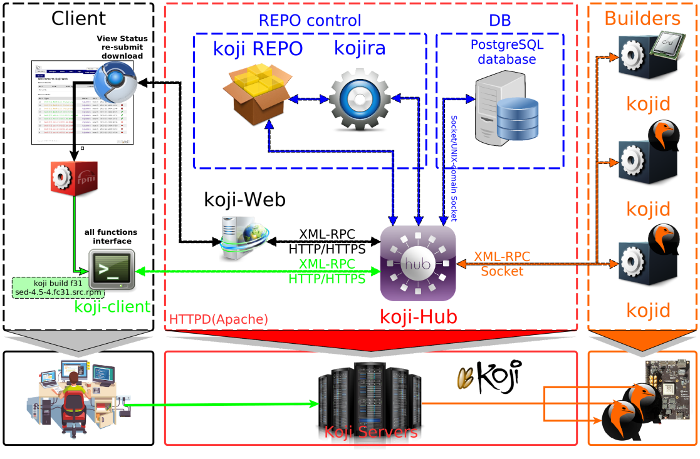

<div align='center' ><font size='20'>koji命令行和Web界面使用</font></div>



# 1. 使用 Koji 命令行工具 cli

对于大多数操作，有一个单一的命令行入口“koji”，它位于 Koji 的主软加包中。

koji 命令使用 Kerberos 在中心服务器中认证，所以你需要一个有效的 Kerberos 票据以使用许多特性。 尽管如此，许多只读指令在没有身份认证的情况下也可以工作。

## a. 探索 Koji

我们尽可能让 Koji 本身包含了使用说明。Koji 命令行终端可以打印出所有的命令列表，并且每一个命令都支持`--help`选项。例如:

```shell
$ koji help
Available commands:
admin commands:
    add-channel               Add a channel
    add-external-repo         Create an external repo and/or add one to a tag
    add-group                 Add a group to a tag
    add-group-pkg             Add a package to a group's package listing
    add-group-req             Add a group to a group's required list
    ...

$ koji build --help
    Usage: koji build [options] <target> <srpm path or scm url>
The first option is the build target, not to be confused with the destination tag (where the build eventually lands) or build tag (where the buildroot contents are pulled from).
You can list all available build targets using the 'koji list-targets' command.
More detail can be found in the documentation.
https://docs.pagure.org/koji/HOWTO/\#package-organization
(Specify the --help global option for a list of other help options)
Options:
    -h, --help            show this help message and exit
    --skip-tag            Do not attempt to tag package
    --scratch             Perform a scratch build
    --rebuild-srpm        Force rebuilding SRPM for scratch build only
...
Try "koji --help" for help about global options
Try "koji help" to get all available commands
Try "koji <command> --help" for help about the options of a particular command
Try "koji help <category>" to get commands under a particular category
Available categories are: admin, all, bind, build, download, info, misc, monitor, search
```

通过查看koji的help手册获得帮助信息。

- koji help \# 输出匿名用户可以使用的命令的帮助信息
- koji build help \# 输出 build 命令的帮助信息
- koji help --admin \# 输出管理员可以使用的命令（即所有命令）帮助信息

## b. 测试koji客户端是否能和koji-hub连接

```shell
koji moshimoshi
```

如果你没有得到类似以下返回信息：

```shell
[anolis@openanolis-workstation root]$ koji moshimoshi
dobrý den, anolis!

You are using the hub at https://koji.tekkamanv.com/kojihub
Authenticated via client certificate /home/tekkamanv/.koji/tekkamanv.pem
```

请联系您的koji 管理员添加相应账户并获得证书文件等。

## c. 查看软件包列表

前面提到过，每个tag都有自己的软件包列表。通过命令`list-pkgs`可以查看一个tag中的软件包列表:

```shell
koji list-pkgs --tag f36

Package        Tag                            Extra Arches     Owner

----------------------- ----------------------- ---------------- --------

ElectricFence   f36                                             kojiadmin
```

第一列是软件包的名称，__第二列告诉您这个软件包从哪个tag继承而来。__ 第三列告诉您软件包的所有者是谁。

## d. 查看最近的编译任务

查看某个 tag 中软件包的最新的编译版本，请使用`latest-build`命令:

```shell
$ koji latest-build  f36 zzuf
Build                           Tag                         Built by

----------------------------------------  --------------------  ---------

zzuf-0.15-16.fc36                f36                           kojiadmin
```

输出结果中不仅显示了软件包的最新编译的版本，而且显示了软件包是从哪个 tag 继承而来的，还显示了这个版本的软件包是由谁编译的(注意：对于那些通过 import 命令导入的软件包，"built by" 这个词可能会产生误解)。 

## e. koji 软件包管理

- 管理tag和build tag
  
  - tag是用来管理导入的PACKAGES的标签，标签可以继承
  
  - buildtag 是用来标志编译软件时需要的标签，buildtag一般继承于tag
    
    ```shell
    koji add-tag nk6.0-mips64el
    
    koji add-tag --parent nk6.0-mips64el --arches=mips64el nk6.0-mips64el-build
    ```
  
  - **修改标签属性**
    
    ```shell
    koji edit-tag  --arches='riscv64' f36dev_rv64_build
    #koji edit-tag [options] <name>
    #  --arches=ARCHES       Specify arches
    #  --perm=PERM           Specify permission requirement
    #  --no-perm             Remove permission requirement
    #  --lock                Lock the tag
    #  --unlock              Unlock the tag
    #  --rename=RENAME       Rename the tag
    #  --maven-support       Enable creation of Maven repos for this tag
    #  --no-maven-support    Disable creation of Maven repos for this tag
    # --include-all Include all packages in this tag when generating Maven repos
    #  --no-include-all      Do not include all packages in this tag when
    #                        generating Maven repos
    #  -x key=value, --extra=key=value
    #   Set tag extra option. JSON-encoded or simple value
    #  -r key, --remove-extra=key   Remove tag extra option
    #  -b key, --block-extra=key     Block inherited tag extra option
    ```
  
  - __移除不用的 tag__
    
    ```shell
    koji remove-tag nk6.0-mips64el
    ```

- 导入SRPM和RPM
  
  ```shell
  koji import [--link] <SRPM1> <SRPM2> ...
  
  koji import [--link] <RPM1> <RPM2> ...
  ```
  
  - __导入RPM包的原则：__
    
    - __应遵循先导入SRPM，然后再导入对应的RPM包的原则;__
    
    - 如果需要导入一个没有SRPM可对应的RPM包，请使用以下命令直接导入RPM：
      
      ```shell
      koji import --create-build <RPM1> <RPM2>
      ```
      
      如果要导入的packages和/mnt/koji目录树在同一个分区，那么建议使--link选项，它以创建硬连接的方式导入，可大大提高速度。
  
  - __如何导入已存在Build ID的 RPM包__
    
      如果要导入一个koji已经编译过包（无论编译失败还是成功），导入会失败。
    
      需要对这个build进行底层处理“__resetBuild +createEmptyBuild__”方可继续导入。
    
    ```shell
    koji call resetBuild <build>
    #  Reset a build so that it can be reimported
        WARNING: this function is highly destructive. use with care.
        nulls task_id
        sets state to CANCELED
        clears all referenced data in other tables, including buildroot and archive component tables
        after reset, only the build table entry is left
    koji call createEmptyBuild <name> <version> <release> <epoch> [owner=None]
    koji call deleteBuild <build>
    #  delete a build, if possible
        Attempts to delete a build. A build can only be deleted if it is
        unreferenced.
        If strict is true (default), an exception is raised if the build cannot
        be deleted.
    
        Note that a deleted build is not completely gone. It is marked deleted and some
        data remains in the database.  Mainly, the rpms are removed.
        Note in particular that deleting a build DOES NOT free any NVRs (or NVRAs) for
        reuse.
    koji call moveBuild <tag_src> <tag_des> <build> [force=False]
    #Move a build from tag1 to tag2
    ```
    
      [https://koji.fedoraproject.org/koji/api](https://koji.fedoraproject.org/koji/api)
  
  - __为导入的软件包打上标签__
    
    ```shell
    koji list-pkgs --quiet | xargs koji add-pkg --owner kojiadmin nk6.0-mips64el
    
    koji list-untagged | xargs -n 1 koji call tagBuildBypass nk6.0-mips64el
    ```

- 添加一个组信息
  
  ```shell
  #Usage: koji add-group <tag> <group>
  koji add-group  nk6.0-mips64el-build build
  koji add-group  nk6.0-mips64el-build srpm-build
  ```

- __修改编译组的属性__
  
  ```shell
  #Usage: koji add-group-pkg [options] <tag> <group> <pkg> [<pkg> ...]
  koji add-group-pkg nk6.0-mips64el-build build bash bzip2 coreutils cpio diffutils regulus-release findutils gawk gcc gcc-c++ grep gzip info make patch regulus-rpm-config rpm-build sed shadow-utils tar unzip util-linux-ng which
  koji add-group-pkg nk6.0-mips64el-build srpm-build bash curl git gnupg make rpm-build shadow-utils regulus-rpm-config regulus-release
  ```

- **手动【重/创】建仓库**
  
  ```shell
  #Usage: koji regen-repo [options] <tag>
  koji regen-repo nk6.0-mips64el-build
  ```

- **添加一个编译target**
  
  ```shell
  koji add-target nk6.0-mips64el nk6.0-mips64el-build
  ```
  
    该选项的完成格式如下：
  
  ```shell
  koji add-target target-name from-build-tag to-dist-tag
  ```
  
  - target-name：target的名称
  - from-build-tag：使用源自build-tag的软件仓库集合
  - to-dist-tag：编译完成的build归档至目标tag的软件仓库集合，__若 to-dist-tag 与 target-name 同名时 to-dist-tag 可省略__

## f. 编译一个软件包(执行build)

编译操作是通过命令行工具启动的。编译一个软件包的语法如下：

```shell
$ koji build <build target> <srpm path or scm url>
```

例如：

```shell
$ koji build f25 git://pkgs.fedoraproject.org/rpms/eclipse-jgit?\#00ca55985303b1ce19c632922ebcca283ab6e296
```

这个 `koji build` 命令在 Koji 中创建了一个编译任务。默认情况下，这个命令会显示状态更新信息直到编译结束，当然你也可以通过 `--nowait` 选项立即回到 shell 中。 可以通过`--help` 选项查看 build 命令的其他选项。

```shell
$ koji build --help
```

- 编译选项
  
  这里有一些 build 命令选项的更多详细介绍：
  
  - `--skip-tag`
    
    通常软件包会在编译完成以后被打上标签（tag）。这个选项会使得打标签的阶段被跳过。__这个软件包(build)会在系统中，但未被打上标签__（将来可以用 tag-build 命令给它打标签）
  
  - `--scratch`
    
    这使得编译成为一个“scratch” 编译。 __这种编译信息不会导入数据库，只是单纯编译。__ 产生的rpms将被放入“\<topdir\>/scratch”中。“__Scratch” 编译不会被跟踪且不能被打标签，__ 但方便测试。“Scratch” 编译一般在一周后被删除。
  
  - `--nowait`
    
    像上面陈述的， 这个让“koji”命令不会去等待编译任务的结果而直接回到shell。
  
  - `--arch-override`
    
    通过这个选项可以修改需要编译的基本的构架集合。这个选项仅用于beta阶段测试使用，但未来可能用于scratch builds而被保留下。

- 构建失败
  
  如果软件包构建失败，你将会看到如下信息。
  
  ```shell
  420066 buildArch (kernel-2.6.18-1.2739.10.9.el5.jjf.215394.2.src.rpm,
            ia64): open (build-1.example.com) -> FAILED: BuildrootError:
            error building package (arch ia64), mock exited with status 10
  ```
  
  你可以通过查看日志文件来查清失败的原因。如果有build.log，那就先看build.log，否则看看init.log。
  
  ```shell
  $ ls -1 <topdir>/work/tasks/420066/*
            <topdir>/work/tasks/420066/build.log
            <topdir>/work/tasks/420066/init.log
            <topdir>/work/tasks/420066/mockconfig.log
            <topdir>/work/tasks/420066/root.log
  ```

- 批量建立任务
  
  ```shell
  ls *.src.rpm | xargs -n 1 koji build --scratch nk6.0-mips64el
  ```
  
  koji import后 package和build都还没有tag，
  
  build状态是complete，无法koji build，需要执行
  
  1. koji add-pkg --owner  kojiadmin dist-s8 go-ovirt-engine-sdk（package_name） 
  2. koji call deleteBuild （NVR），
  3. koji call resetBuild \<NVR\>  
  4. koji build dist-nk5u8 xxxx.src.rpm。
  
  1步骤：给 package种加tag 才可以编译。2，3步是该状态complete为canceled

# 2. Web 界面

查阅Koji数据的主要界面是一个Web应用。大部分界面是只读的，但如果你已登录（见下文）并有足够的权限，有一些操作是可以通过Web界面进行的。例如：

- 取消一个编译（build）任务
- 重新提交一个失败的任务

拥有管理员权限的话，可以有更过的操作，例如：

- 创建/编辑/删除有一个标签（tag）
- 创建/编辑/删除有一个编译目标（target）
- 使能/禁用一个编译主机（build host）

网站使用 Kerberos 进行身份验证。为了登录，你需要一个 Kerberos 票据，且你的浏览器需要配置以发送 Kerberos 信息给服务器。

对于火狐浏览器，你需要进入 about:config 页面以设置 Kerberos 参数。在搜索栏中用'negotiate' 从列表中过滤出需要修改的项目。修改 network.negotiate-auth.trusted-uris选项为你想要认证的域，例如 .example.com。 如果使能了 Kerberos 票据透传（passing），则无需此配置，你可以将 network.negotiate-auth.delegation-uris 留空。

为了获得一个 Kerberos 票据，请使用 kinit 命令。