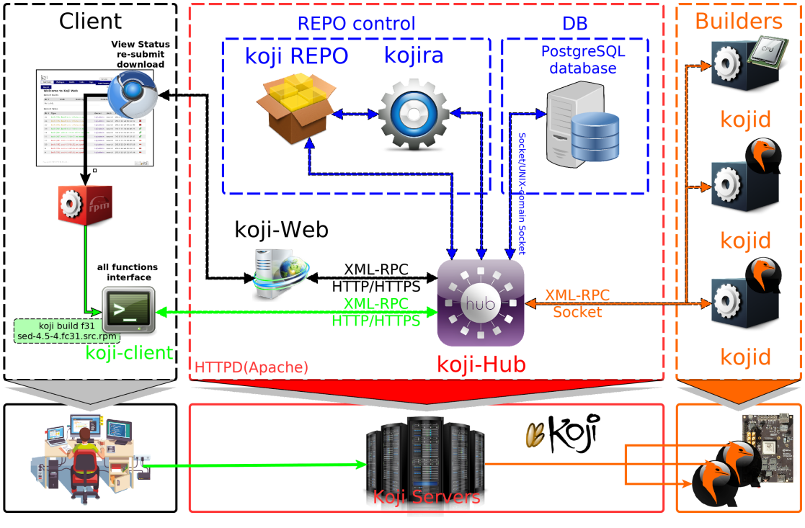
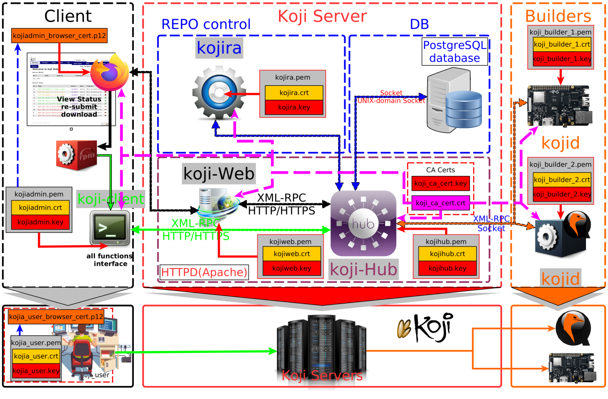
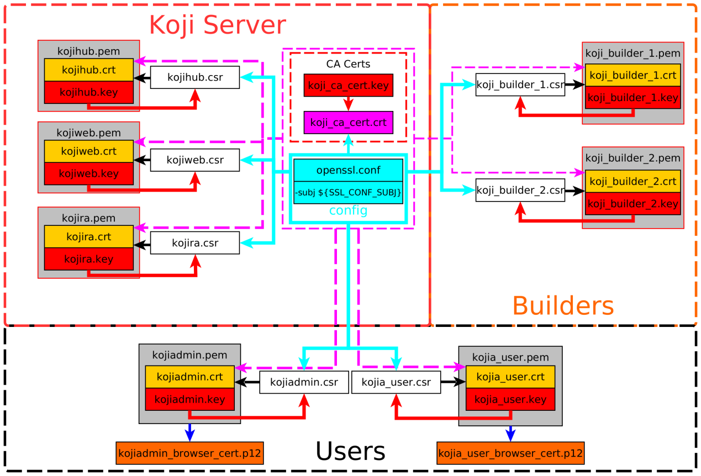
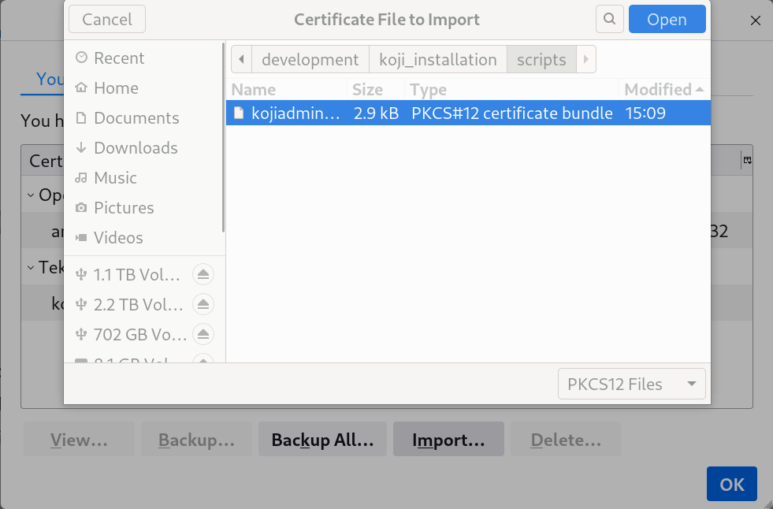
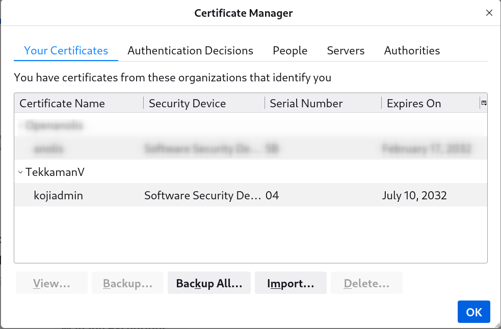
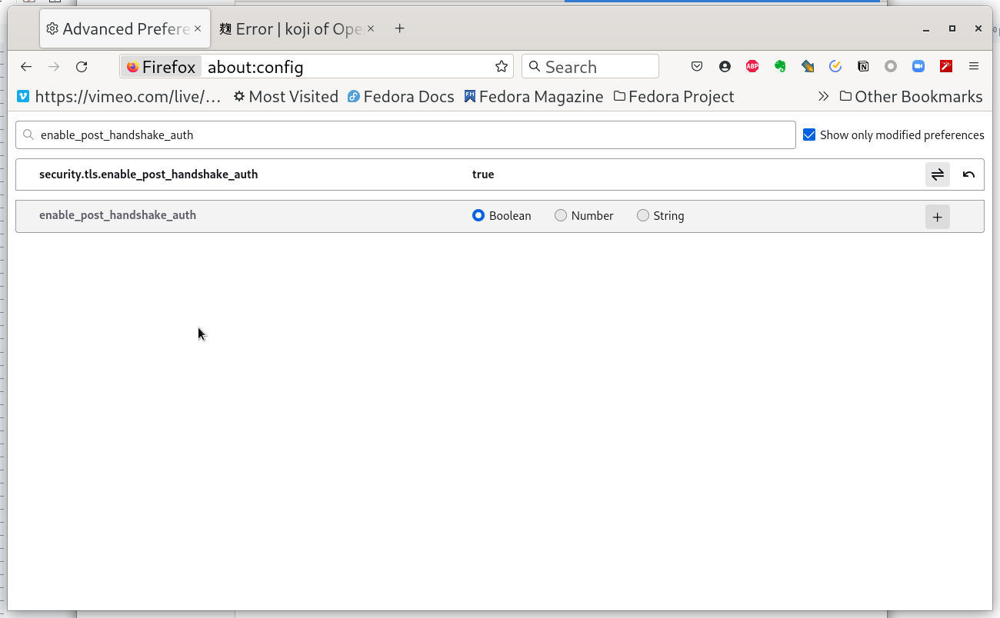

<div align='center' ><font size='20'>Kojihub 部署</font></div>



# 0. 基础知识

- 软件安装 SSL 及其证书，（或Kerberos 认证的基本知识）
- PostgresSQL的基本使用：用 PostgresSQL 建立数据库和导出表的基本知识
- http服务器（Apache）配置的基本知识
- yum / createrepo / mock 的基本知识以及RPM 打包的基本知识
- 使用命令行的基础知识以及Koji CLI客户端的简单使用

注意：Koji目录需要大量空间，在 kojihub.conf 里配置。如果 Koji 使用 mock 作为后端编译工具，用户会发现 /var/lib/mock 非常大。用户需要在 kojid.conf 中调整 mock 的默认编译目录。

# 1. 部署准备工作

a. 安装依赖软件

```shell
sudo dnf install postgresql-server mod_ssl  httpd
```

\* mod_python  mod_auth_kerb (for Kerberos authentication)

b. 安装Koji软件

```shell
sudo dnf install koji-hub koji-web koji-utils
```

# 2. 软件配置

Koji 主要支持 Kerberos 和 SSL Certificate 认证。对于基本的命令行访问，通常的用户名/密码组合也可以。但__kojiweb不支持用户名/密码认证，__故只有Kerberos 或 SSL Certificate 其中一种认证建立，kojiweb 才会工作。

- Kerberos验证：前提是已经具备了可用的 Kerberos 环境，初始化 Koji 用户数据时必须已经建立好管理用户的安全凭证；
- **SSL验证：需要为 xmlrpc 服务程序、Koji 其他各组件、管理用户准备好 SSL 证书。**

## 准备 SSL 安全验证的环境

在__缺乏 kerberos 支持__的环境下，选用__ssl证书来进行身份认证__。

### 身份认证配置(ssl)

在内部小规模部署的情况下，直接使用自签CA来签发证书进行身份认证较为简单。



**在/etc/pki/koji下处理全部自签名证书的问题**

```shell
sudo mkdir /etc/pki/koji
cd /etc/pki/koji
```

1. 建立目录

   ```shell
   sudo mkdir {certs,confs,private}
   ```

2. 创建CA相关文件

   - 基础设置模板

     in 工作目录中（可以是__/etc/pki/koji__，但不是必须的__）, 创建文件openssl.cnf__文件

     ```shell
     vi openssl.conf
     ```

     内容如下：

     ```shell
     WORK                    = /etc/pki/koji
     RANDFILE                = .rand
     CANAME			    	= koji
     
     [ca]
     default_ca              = ca_default
     [ca_default]
     dir                     = ${ENV::WORK}
     certs                   = $dir/certs
     crl_dir                 = $dir/crl
     database                = $dir/index.txt
     new_certs_dir           = $dir/newcerts
     certificate             = $dir/${ENV::CANAME}_ca_cert.crt
     private_key             = $dir/private/${ENV::CANAME}_ca_cert.key
     serial                  = $dir/serial
     crl                     = $dir/crl.pem
     x509_extensions         = usr_cert
     name_opt                = ca_default
     cert_opt                = ca_default
     default_days            = 3650
     default_crl_days        = 30
     default_md              = sha256
     preserve                = no
     policy                  = policy_match
     
     [policy_match]
     countryName             = match
     stateOrProvinceName     = match
     localityName		    = match
     organizationName        = match
     organizationalUnitName  = optional
     commonName              = supplied
     emailAddress            = optional
     
     [req]
     default_bits            = 2048
     default_keyfile         = ${ENV::WORK}/private/${ENV::CANAME}_ca_cert.key
     default_md              = sha256
     distinguished_name      = req_distinguished_name
     x509_extensions         = v3_ca 
     # The extensions to add to the self signed cert
     string_mask             = MASK:0x2002
     
     [req_distinguished_name]
     
     [usr_cert]
     basicConstraints                = CA:FALSE
     nsComment                       = "OpenSSL Generated Certificate"
     subjectKeyIdentifier            = hash
     authorityKeyIdentifier          = keyid,issuer:always
     
     [v3_ca]
     subjectKeyIdentifier            = hash
     authorityKeyIdentifier          = keyid:always,issuer:always
     basicConstraints                = CA:true
     ```

   - 初始化CA数据库文件

     CA 证书是用来签发其他 SSL 证书的密钥/证书对。在对 Koji 各组件进行配置时，客户端和服务端程序要用到的 CA 证书都来自这一步骤生成的 CA 证书。CA 证书放在 /etc/pki/koji 目录下，其他各组件的证书则放在 /etc/pki/koji/certs 目录下。**index.txt** 中会记录所有签发证书的相关信息。

     在/etc/pki/koji目录下，

     - 创建空文件__index.txt__备用

     - 创建文本文件serial来存储序号，初始内容为两个ascii字符: 01

       ```shell
       sudo touch index.txt
       sudo vi serial
       ```

   - 创建CA证书

     如果使用脚本来自动化证书生成，可以参考使用下面的命令：

     ```shell
     WORK_DIR=/etc/pki/koji
     
     EXPIRE_DAYS=3650
     SSL_CONF_TEMPLATE=openssl.conf
     caname=koji
     CA_CERT_PRI_KEY=${WORK_DIR}/private/${caname}_ca_cert.key
     CA_CERT_CRT=${WORK_DIR}/${caname}_ca_cert.crt
     PASSPHRASE_FILE=pw.txt
     ## for your own instance, please change them
     SERVER_NAME=koji.tekkamanv.com
     COMMON_NAME=${SERVER_NAME}
     EMAIL_ADDR=tekkamanv@${SERVER_NAME}
     ORG_UNIT=Koji
     SSL_CONF_SUBJ_COM='/C=CN/ST=Guangdong/L=Shenzhen/O=TekkamanV'
     SSL_CONF_SUBJ="${SSL_CONF_SUBJ_COM}/OU=${ORG_UNIT}/CN=${COMMON_NAME}/emailAddress=${EMAIL_ADDR}"
     
     -----------------------------------------------------------------
     sudo openssl genrsa -out ${CA_CERT_PRI_KEY} 2048
     sudo openssl req -verbose -new -x509 -passout file:${PASSPHRASE_FILE} \
             -days ${EXPIRE_DAYS} \
             -config ${SSL_CONF_TEMPLATE} \
             -subj ${SSL_CONF_SUBJ} \
             -out ${CA_CERT_CRT}
     ```

     上述命令不会对证书相关的信息进行二次确认，因为所有信息都已经在配置文件和命令行中。

     __其中 organizationUnitName （OU）和 commonName（CN） 在生成不同组件的证书是需要进行相应调整。__对于 CA 证书本身，这些信息没有特殊限制，建议使用服务器的 FQDN 作为 commonName 。

     - __FQDN__：(Fully Qualified Domain Name)全限定域名：同时带有主机名和域名的名称。 （通过符号“.”） 例如：主机名是koji,域名是tekkamanv.com,那么FQDN就是koji.tekkamanv.com。

3. 签发模块证书

   

   - 简单的模块证书签发流程脚本范例：cert-issue.sh

     ```shell
     #!/bin/bash
     WORK_DIR=/etc/pki/koji
     
     EXPIRE_DAYS=3650
     PASSPHRASE_FILE=pw.txt
     SSL_CONF_TEMPLATE=openssl.conf
     # if you change your certificate authority name to something else you will
     # need to change the caname value to reflect the change.
     caname=koji
     CA_CERT_PRI_KEY=${WORK_DIR}/private/${caname}_ca_cert.key
     CA_CERT_CRT=${WORK_DIR}/${caname}_ca_cert.crt
     
     # __HOST_NAME is equal to parameter one or the first argument when you actually
     # run the script
     ORG_UNIT=Koji
     SERVER_NAME=koji.tekkamanv.com
     __ORG_UNIT=${ORG_UNIT}
     __EMAIL_ADDR=${1}@${SERVER_NAME}
     __HOST_NAME=${1}
     __PRI_KEY=${WORK_DIR}/private/${__HOST_NAME}.key
     __CSR_FILE=${WORK_DIR}/certs/${__HOST_NAME}.csr
     __CRT_FILE=${WORK_DIR}/certs/${__HOST_NAME}.crt
     __PEM_FILE=${WORK_DIR}/${__HOST_NAME}.pem
     
     __COMMON_NAME=${1}
     SSL_CONF_SUBJ_COM='/C=CN/ST=Guangdong/L=Shenzhen/O=TekkamanV'
     __SSL_CONF_SUBJ="${SSL_CONF_SUBJ_COM}/OU=${__ORG_UNIT}/CN=${__COMMON_NAME}/emailAddress=${__EMAIL_ADDR}"
     
     -----------------------------------------------------------------
     sudo openssl genrsa \
     	-out ${__PRI_KEY} 2048 \
     && \
     sudo openssl req -new -nodes -passin file:${PASSPHRASE_FILE} \
     	-config ${SSL_CONF_TEMPLATE} \
     	-subj ${__SSL_CONF_SUBJ} \
     	-key ${__PRI_KEY} \
     	-out ${__CSR_FILE} \
     && \
     sudo openssl ca -batch -passin file:${PASSPHRASE_FILE} \
     	-config ${SSL_CONF_TEMPLATE} \
     	-out ${__CRT_FILE} \
     	-infiles ${__CSR_FILE} \
     && \
     sudo cat ${__CRT_FILE} ${__PRI_KEY}  | sudo tee ${__PEM_FILE} > /dev/null
     ```

     签发模块证书过程中应注意common name（CN）：

     - **若用于用户认证应使用用户名称，**
     - **若用于服务器认证，则应该使用服务器的主机名（域名）。**

     在使用脚本签发证书前，请确保脚本有执行权限。

   - 签发Koji 各组件以及用户证书

     Koji 每一个组件都需要单独的证书来标识自身。

     - 服务端组件(kojihub/kojiweb)

       __其中 kojihub 和 kojiweb 的证书是作为服务端证书需要通过客户端验证的，故应将证书的 CN ( common name ) 配置为服务器的 FQDN__，否则客户端程序会提示证书的 common name 和服务器主机名不匹配。

       **生成 kojiweb 的证书时，证书的所有相关信息（如，C、ST、L、O、CN 等）都需要加入到 /etc/koji-hub/hub.conf 中的 [ProxyDNs 配置](#_AuthError 问题)中去。**

       为方便识别，可将这2个证书的 OU （organizationalUnitName）分别配置为 kojihub 和 kojiweb 。

     - 客户端组件(kojira/kojid/kojiadmin/koji_user)

       __其他证书（如 kojira、kojid、管理用户以及其他用户）作为客户端证书，CN 只需要设置为这些对象用来登录的服务端的用户名即可__，如 __kojira 的证书 CN 应该设置为 kojira。__原因是证书的 CN 需与 koji 数据库中的用户名匹配。在这些组件和服务端程序通信时，若数据库中找不到和证书 的CN 对应的用户，验证将无法通过，客户端访问将会被拒绝。

       **当使用 koji add-host 命令添加builder时，会在 koji 数据库中添加一个用户（其将出现在builder列表中，但不出现在user列表中）。这个用户的名称需与builder所使用证书的 CN 保持一致，否则构建主机将会无法访问 kojihub 服务器。必须使用不同的common name（CN），建议使用不同的email或OU！**

     | 管理员用户   | sudo ./cert-issue.sh kojiadmin                               |
     | ------------ | ------------------------------------------------------------ |
     | **koji**组件 | **sudo ./cert-issue.sh kojihub**<br />**sudo ./cert-issue.sh kojiweb**<br />**sudo ./cert-issue.sh kojira** |

   - 生成 PKCS12 用户证书 （供网页浏览器使用）

     PKCS12 用户证书是为了用户通过网页登录 kojiweb 的koji站点准备的。

     ```shell
     WORK_DIR=/etc/pki/koji
     # if you change your certificate authority name to something else you will
     # need to change the caname value to reflect the change.
     caname=koji
     CA_CERT_CRT=${WORK_DIR}/${caname}_ca_cert.crt
     
     __USER_NAME=${1}
     __PRI_KEY=${WORK_DIR}/private/${__USER_NAME}.key
     __CRT_FILE=${WORK_DIR}/certs/${__USER_NAME}.crt
     __P12_FILE=${WORK_DIR}/certs/${__USER_NAME}_browser_cert.p12
     
     ---------------------------------------------------------------
     sudo openssl pkcs12 -export \
     	-inkey ${__PRI_KEY} \
     	-in ${__CRT_FILE} \
     	-CAfile ${CA_CERT_CRT} \
     	-out ${__P12_FILE}
     ```

4. 客户端证书配置

   - 为命令行用户配置证书

     命令行用户使用 koji 命令行工具可以对 koji 系统进行管理。

     __以kojiadmin为例__，创建 kojiadmin 用户（koji 系统中的用户，并生成用户证书）之后，

     - koji 命令行工具默认使用全局配置文件 /etc/koji.conf，将该文件复制到 ~/.koji/目录下，并根据情况进行调整。
     - 将 CA 证书 和 自己的用户证书复制到系统用户（普通用户也可以）的 ~/.koji 目录之下

     ```shell
     mkdir ~/.koji
     cp  /etc/koji.conf  ~/.koji/
     # 适当修改koji.conf，注意下面的证书和CA路径会出现在配置中
     cp /etc/pki/koji/kojiadmin.pem ~/.koji/client.crt
     # 注意：用户证书需要用 PEM 文件而不是 CRT
     cp /etc/pki/koji/koji_ca_cert.crt ~/.koji/serverca.crt
     ```

     配置新用户操作相同，也是拷贝配置文件、证书和ca证书到相应位置，参见配置新用户。
     
   - 为网页浏览器配置用户证书
   
     PKCS12 用户证书的生成，请参考生成生成 PKCS12 用户证书 （供网页浏览器使用），并在__使用前导入证书（用户和CA）。__
   
     **当前只有 火狐浏览器, 经验证可通过证书登陆；而chrome不支持证书登陆。**
   
     \- - **首先请保证证书的读取权限对当前用户是可读的。** - 进入__about:preferences#privacy__ 页面的__“Certificates”__配置，并点击__“View Certificates…”__进入 “Certificate Manager”的 “__Your Certificates”标签__。点击 **“Import...”**,选择刚刚的p12文件即可。
     
     
     
     
     
     以下是可能遇到的问题和解决方案：
     
     - Post-Handshake 问题
     
       如果点击login时出现以下警告，说明浏览器当前不支持 Post-Handshake，
     
       ```shell
       Forbidden
       You don't have permission to access this resource.Reason: Cannot perform Post-Handshake Authentication.
       ```
     
       对于 火狐浏览器，我们可以用如下操作，打开这个功能；**但是chrome不支持次特性，所以暂不支持在Chrome中登陆。**
     
       ```shell
       Firefox: about:config
       security.tls.enable_post_handshake_auth -------> true
       ```
     
       
     
     - AuthError 问题
     
       ```shell
       An error has occurred in the web interface code. This could be due to a bug or a configuration issue.
       koji.AuthError: unable to obtain a session (ssl auth failed: koji.AuthError: emailAddress=kojiweb@koji.tekkamanv.com,CN=koji.tekkamanv.com,OU=kojiweb,O=TekkamanV,L=Shenzhen,ST=Guangdong,C=CN is not authorized to login other users )
       ```
     
       解决方法，在/etc/koji-hub/hub.conf 中将上面***\*类似的语句\*******\*原封不动地\****赋给ProxyDNs变量，如：
     
       ```shell
       # vi /etc/koji-hub/hub.conf
       DNUsernameComponent = CN
       ProxyDNs = emailAddress=kojiweb@koji.tekkamanv.com,CN=koji.tekkamanv.com,OU=kojiweb,O=TekkamanV,L=Shenzhen,ST=Guangdong,C=CN
       
       # 注：当前版本mod_ssl（大于2.3.11）的分割符为“，”，老版本（小于2.3.11）的为“/”。
       ```
     
     - server secret not configured问题
     
       ```shell
       An error has occurred in the web interface code. This could be due to a bug or a configuration issue. 
       koji.AuthError: Unable to authenticate, server secret not configured 
       ```
     
       解决方法，在/etc/kojiweb/web.conf 中uncomment“Secret = CHANGE_ME”, 后面的值随意。
     
       vi /etc/kojiweb/web.conf
     
       ```shell
       # This must be CHANGED to random value and uncommented before deployment
        #Secret = CHANGE_ME
       Secret = tekkamanv
       ```
     
       随后重启以下web服务。
     
       ```shell
       [root@tekkamanv koji]# systemctl restart httpd postgresql
       ```
     
     
     

## 准备数据库

1. 创建koji用户用于管理数据库

```shell
sudo useradd koji
#sudo passwd koji
```

koji账户sudo权限只在初始化数据库使用，故无需设置密码，从有sudo权限的账户sudo -iu切换过来即可。

2. 初始化数据库软件，并使能服务:

```shell
[tekkamanninja@Samantha ~]$ sudo postgresql-setup initdb
WARNING: using obsoleted argument syntax, try --help
WARNING: arguments transformed to: postgresql-setup --initdb --unit postgresql
* Initializing database in '/var/lib/pgsql/data'
* Initialized, logs are in /var/lib/pgsql/initdb_postgresql.logsudo [tekkamanninja@Samantha ~]$ sudo systemctl enable --now postgresql
Created symlink /etc/systemd/system/multi-user.target.wants/postgresql.service → /usr/lib/systemd/system/postgresql.service.
```

3. 为koji建立数据库环境

针对koji的配置分为以下几步：

- **建立 koji 数据库用户**
- **建立 koji 数据库**
- **为 koji 数据库用户设置密码**
- **导入 koji 数据库的 schema**

```shell
#建立 koji 数据库用户
[tekkamanninja@Samantha ~]$ sudo -iu postgres
[postgres@Samantha ~]$ createuser --no-superuser --no-createrole --no-createdb koji
#建立 koji 数据库
[postgres@Samantha ~]$ createdb -O koji koji
#为 koji 数据库用户设置密码
[postgres@Samantha ~]$ psql -c "alter user koji with encrypted password 'tekkamanv';"
ALTER ROLE
[postgres@Samantha ~]$ exit
logout
```

a. **配置数据库服务**

修改 /var/lib/pgsql/data/pg_hba.conf 的配置，改为如下配置：

```shell
#TYPE   DATABASE    USER    CIDR-ADDRESS      METHOD
host    koji        koji    127.0.0.1/32      trust
host    koji        koji     ::1/128          trust
#如果要使用 UNIX socket 和数据库通信（这种方式下，Koji组件的配置文件中 DBHost 选项不能进行设置），可以使用这样的配置：
local   koji        apache                    trust
local   koji        koji                      trust
```

- **如果服务器还有外部 IP 地址的话，可以再加上：**

```shell
#TYPE   DATABASE    USER    CIDR-ADDRESS      METHOD
host    koji        koji    $IP_ADDRESS/32    trust
```

- **注意： 如果强制要求使用密码验证访问数据，可以将上述配置中的 trust 改为 md5**

在/var/lib/pgsql/data/postgresql.conf中合适位置添加:  监听所有网络接口。

```shell
listen_addresses = '*’
```

- **对于高并发的访问的优化：**

```shell
max_connections = 512			# (change requires restart)
superuser_reserved_connections = 3	# (change requires restart)
```

Reference : https://www.cnblogs.com/wy123/p/14087274.html

- **重新启动数据库服务进程**

为了配置生效，让数据库重新读取配置文件：

```shell
sudo systemctl restart postgresql
#sudo systemctl reload postgresql
[tekkamanninja@Samantha ~]$ sudo -iu koji
#导入koji数据库模版schema:
[koji@Samantha ~]$ psql koji koji < /usr/share/doc/koji/docs/schema.sql 
...
#进入数据库交互模式添加'kojiadmin'用户，此方法仅限ssl认证:
[koji@Samantha ~]$ psql
psql (13.4)
Type "help" for help.

koji=> insert into users (name, status, usertype)
koji-> values ('kojiadmin', 0, 0);
INSERT 0 1
#赋予指定用户管理权限：
#使用下面的 sql 语句可以为指定用户（user_id）赋予管理权限：
koji=> insert into user_perms (user_id, perm_id, creator_id)
#values (<user_id>, 1, <creator_id/user_id>); 
koji-> values (1, 1, 1);
INSERT 0 1
#其中初始管理员的user_id和creator_id默认应该是1，可使用以下方法来读取用户表查看id。
koji=> select * from users;
id |   name    | password | status | usertype 
----+-----------+----------+--------+----------
1 | kojiadmin |          |      0 |        0
(1 row)

koji=> quit
[koji@Samantha ~]$ exit
logout
[tekkamanninja@Samantha ~]$  
```

b. **初始化Koji专用数据库**

Koji 管理用户(__kojiadmin__)需要手动通过 sql 语句添加到数据库中。当管理用户添加成功之后，其他的用户操作（增加、删除用户，修改用户权限等）可以通过 koji 命令完成。

不过，如果使用简单的用户名和密码验证方式，则配置或者修改用户密码仍然需要通过 sql 语句直接操作数据库完成，因为 koji 命令没有提供对用户密码进行操作的接口。

针对不同的验证方式，添加 Koji 管理用户的 sql 语句也不同。

c. **启用数据库刷新定时器（？）**

```shell
[tekkamanninja@Samantha ~]$ sudo systemctl enable --now koji-sweep-db.timer
[sudo] password for tekkamanninja: 
Created symlink /etc/systemd/system/timers.target.wants/koji-sweep-db.timer → /usr/lib/systemd/system/koji-sweep-db.timer.
```

d. **重启数据库**

```shell
sudo systemctl restart postgresql
```

Issue：

```shell
[tekkamanninja@Samantha development]$ koji moshimoshi 
2022-07-26 21:03:42,414 [ERROR] koji: AuthError: unable to obtain a session (ssl auth failed: koji.ServerOffline: database outage)
```

**测试可以尝试通过“重启数据库”修复。**

## 配置Koji hub

1. 修改http基本设置，/etc/httpd/conf.d/kojihub.conf

该文件需要针对安全验证方案进行一些调整，不过需要改动的地方不多，参阅配置文件中的注释信息即可。**以下配置需要uncomment。**

```shell
<Location /kojihub/ssllogin>
SSLVerifyClient require
SSLVerifyDepth  10
SSLOptions +StdEnvVars
</Location>
```

2. 修改koji-hub配置文件，/etc/koji-hub/hub.conf

该文件是 Koji-hub 的主要配置文件，首先需要数据库、KojiWebURL等基本信息。关于安全验证方面也在该文件中。

```shell
##  Basic options  ##
DBName = koji
DBUser = koji
#DBHost = db.example.com
DBHost = 127.0.0.1
#DBPort = 5432
#DBPass = example_password
DBPass = tekkamanv
KojiDir = /mnt/koji
LoginCreatesUser = On
KojiWebURL = http://koji.tekkamanv.com/koji

-------------------------------------------------------------

#安全验证配置: 使用 SSL 证书验证时, mod_ssl （版本大于 2.3.11）配置：
DNUsernameComponent = CN
ProxyDNs = emailAddress=kojiadmin@koji.tekkamanv.com,CN=kojiadmin,OU=Koji,O=TekkamanV,ST=Guangdong,C=CN
```

3. 修改ssl配置/etc/httpd/conf.d/ssl.conf

如果使用 SSL 证书验证的话，需要指定证书文件所在位置，以及强制要求对客户端进行 SSL 证书限制，如：

```shell
SSLCertificateFile /etc/pki/koji/certs/kojihub.crt
SSLCertificateKeyFile /etc/pki/koji/private/kojihub.key
SSLCertificateChainFile /etc/pki/koji/koji_ca_cert.crt
SSLCACertificateFile /etc/pki/koji/koji_ca_cert.crt
#SSLVerifyClient require
#SSLVerifyDepth  10
```

4. 创建目录/mnt/koji，并重启webserver

上面的配置示例中，**KojiDir 设置为 /mnt/koji**，如果更改了该路径，仍然需要建立一个 /mnt/koji 软连接指向实际的 Koji 文件目录。在部署 Koji 其他组件之前需要为该目录建立基本的结构，并配置好权限：

```shell
sudo mkdir -p /mnt/koji/{packages,repos,repos-dist,scratch,work}
sudo chown -R apache:apache   /mnt/koji/*
sudo systemctl restart httpd
sudo systemctl enable --now httpd
```

5. 配置 SELinux

如果服务器系统中 __SELinux 以 Enforcing 模式运行__，则进行一些配置：

- 允许 apache 访问 Postgresql 数据库；
- 允许 apache 在磁盘上写入某些文件。

配置方法参考：

```shell
[tekkamanninja@Samantha ~]$ sudo setsebool -P httpd_can_network_connect_db=1 allow_httpd_anon_write=1 httpd_can_network_connect=1
[sudo] password for tekkamanninja: 
[tekkamanninja@Samantha ~]$ sudo chcon -R -t public_content_rw_t /mnt/koji/*
```

- 如果 /mnt/koji 是挂载的 NFS 共享目录，则还需要设置 httpd_use_nfs：

```shell
sudo setsebool -P httpd_use_nfs=1
```

- 如果出现以下错误：

```shell
Error
The web interface is having difficulty communicating with the main server. This most likely indicates a network issue. 
requests.exceptions.ConnectionError: HTTPConnectionPool(host='koji.tekkamanv.com', port=80): Max retries exceeded with url: /kojihub (Caused by NewConnectionError('<urllib3.connection.HTTPConnection object at 0x7fb04c7c0160>: Failed to establish a new connection: [Errno 13] Permission denied')) 
```

解决方法：

```shell
sudo setsebool -P httpd_can_network_connect=1
```

6. 配置koji cli并测试koji-hub

完成上述配置之后，理论上重新启动 apache 服务之后，__Koji-hub 应该可以正常工作，可以通过下文即将提到的 koji 命令进行检测。__(此时kojiweb还未配置)

koji 命令行工具是 Koji 系统的标准客户端工具，使用 koji 命令可以完成大部分的工作。

- 默认用户配置文件 ~/.koji/config
- 全局配置文件 /etc/koji.conf

```shell
mkdir -p ~/.koji
cd ~/.koji/
cp /etc/koji.conf config
vi config

---------------------------------------------
[koji]

;url of XMLRPC server
server = http://koji.tekkamanv.com/kojihub

;url of web interface
weburl = http://koji.tekkamanv.com/koji

;url of package download site
topurl = http://koji.tekkamanv.com/kojifiles

;path to the koji top directory
topdir = /mnt/koji

; fedora uses kerberos auth
; authtype = kerberos
authtype = ssl

;configuration for SSL authentication

;client certificate
cert = ~/.koji/client.crt

;certificate of the CA that issued the HTTP server certificate
serverca = ~/.koji/serverca.crt
```

- CA证书和用户证书：请参考：●4.a为命令行用户配置证书

如果配置成功，可以通过以下命令测试koji客户端是否能和koji-hub连接：

```shell
[tekkamanninja@Samantha ~]$ koji moshimoshi 
góðan daginn, kojiadmin!

You are using the hub at https://koji.tekkamanv.com/kojihub
Authenticated via client certificate /home/tekkamanninja/.koji/client.crt
```

如果你没有得到类似上面的返回信息，请联系您的koji 管理员添加相应账户并获得证书文件等。

## 部署koji web

koji-web 的主要配置文件，需要指明 koji-hub 服务、koji 文件目录以及 kojiweb 自身的 url 地址，另外关于安全验证相关的配置也是必须的。

配置文件中的 Secret 需要需要进行配置，指定一个特定的字符串即可，参见server secret not configured问题

1. /etc/kojiweb/web.conf文件修改内容：

   ```shell
   SiteName = koji
   KojiHubURL = http://koji.tekkamanv.com/kojihub
   KojiFilesURL = http://koji.tekkamanv.com/kojifiles
   
   # SSL authentication options
   # 其中 WebCert 对应的文件必须同时包含公钥和私钥信息，也就是pem文件
   WebCert = /etc/pki/koji/kojiweb.pem
   KojiHubCA = /etc/pki/koji/koji_ca_cert.crt
   # This must be CHANGED to random value and uncommented before deployment
   # Secret = CHANGE_ME
   Secret = tekkamanv
   ```

   注意：此处的__每行开头不可以有空格，否则会出现类似错误：__

   ```shell
   An error has occurred in the web interface code. This could be due to a bug or a configuration issue. 
   koji.AuthError: configuration error: set WebAuthType or on of WebPrincipal/WebCert options
   ```

2. /etc/httpd/conf.d/kojiweb.conf修改内容

   根据安全验证的类型进行调整，根据配置文件中提供的注释信息进行配置即可。

   - koji-web SSL 验证， 开启 /koji/login 的 SSL 验证。

     ```shell
     # uncomment this to enable authentication via SSL client certificates
     <Location /koji/login>
         SSLVerifyClient require
         SSLVerifyDepth  10
         SSLOptions +StdEnvVars
     </Location>
     ```

     /etc/httpd/conf.d/ssl.conf修改内容(在同一个机器上实现时，在koji-hub阶段已经配好)

     ```shell
     SSLCertificateFile /etc/pki/koji/certs/kojihub.crt
     SSLCertificateKeyFile /etc/pki/koji/private/kojihub.key
     SSLCertificateChainFile /etc/pki/koji/koji_ca_cert.crt
     SSLCACertificateFile /etc/pki/koji/koji_ca_cert.crt
     ```

3. 文件系统相关配置

   为了 Koji-web 可以正常工作，需要对 /mnt/koji 目录的访问权限进行修改，使得不同的组件都可以访问该目录。该目录会在下面这些配置文件中出现：

   - **/etc/kojiweb/web.conf 中的 KojiFilesURL**
   - **/etc/kojid/kojid.conf 中的 topurl**
   - **/etc/koji.conf 中的 topurl**

   apache 的配置如下（注意：针对 apache 的版本不同，访问控制配置的格式也有不同）: **/etc/httpd/conf.d/kojihub.conf**

   ```shell
   Alias /kojifiles /mnt/koji/
   <Directory "/mnt/koji/">
       Options Indexes SymLinksIfOwnerMatch
       #If your top /mnt/koji directory is not owned by the httpd user, then
       #you will need to follow all symlinks instead, e.g.
       #Options Indexes FollowSymLinks
       AllowOverride None
       IndexOptions +NameWidth=*
       <IfVersion < 2.4>
           Order allow,deny
           Allow from all
       </IfVersion>
       <IfVersion >= 2.4>
           Require all granted
       </IfVersion>
   </Directory>
   ```

4. 验证 Koji-web 是否可以正常工作

   重启 httpd 服务之后，访问 koji-web 的地址，确认是否可以正常访问、登录以及完成各种操作。

   - 测试注意事项：临时关闭安全机制

     | 开启防火墙     | sudo systemctl start firewalld                               |
     | -------------- | ------------------------------------------------------------ |
     | Option1        | sudo firewall-cmd --add-service=https sudo firewall-cmd --add-service=http |
     | Option2        | sudo firewall-cmd --add-service=https **--permanent**sudo firewall-cmd --add-service=http **--permanent** |
     | Option3        | sudo firewall-cmd --add-port=443/tcpsudo firewall-cmd --add-port=80/tcp |
     | 彻底关闭防火墙 | sudo systemctl stop firewalld                                |
     | 设置SElinux    | sudo setenforce permissive                                   |

   - 打开调试信息

     当网页出现问题，并在页面中出现“Full tracebacks disabled”，说明kojiweb的调试没有打开，可以通过uncomment以下内容并重启httpd来开启调试信息：

     ```shell
     sudo vi /etc/kojiweb/web.conf
     # PythonDebug = True
     sudo systemctl restart httpd
     ```

## 配置并启用kojira

1. 安装Kojira

   ```shell
   sudo yum install koji-utils
   ```

2. 在koji中为 kojira 添加用户并配置

   ```shell
   koji add-user kojira
   #kojira 用户需要拥有 repo 权限
   koji grant-permission repo kojira
   ```

   - 其他说明：

     - kojira 对 /mnt/koji 要有读写权限；

     - kojira 只能同时运行一个示例；

     - 不建议将 kojira 和 kojid 放在相同的服务器，因为 kojid 对 /mnt/koji 只需要读权限；

     - 添加新的 tag 时，kojira 可能需要重启才能正确识别。

   - 设置koji-hub 的 url 及安全验证配置

     使用 SSL 证书验证：/etc/kojira/kojira.conf

     ```shell
     ;在 /etc/kojira/kojira.conf 中添加 koji-hub 的 url 地址：
     server=http://koji.tekkamanv.com/kojihub
     ;使用 SSL 证书验证
     cert = /etc/pki/koji/kojira.pem
     serverca = /etc/pki/koji/koji_ca_cert.crt
     ```

   - /etc/sysconfig/kojira

     kojira 程序对 /mnt/koji/repos 目录要有读写权限，如果该目录的权限无法调整（比如配置了 root_squash 的 NFS 共享目录等），可以在 /etc/sysconfig/kojira 中配置 RUNAS= 指定的用户来获取需要的权限。

3. 使能并启动服务

   ```shell
   sudo systemctl enable --now kojira
   ```

## 配置新用户

在koji系统投入使用后，需要添加用户，并给用户赋予不同的权限（管理员、工程师），koji是通过“permissions”权限系统来管理的。配置新用户主要有以下步骤：

1. 生成用户证书

   请参考[Koji 各组件以及管理用户签发证书]和 [生成 PKCS12 用户证书（供网页浏览器使用）]。

   > （注：以下所有的koji命令都以Koji系统管理员的身份运行）

2. 添加用户

   ```shell
   koji add-user koji_user
   ```

3. 配置用户权限

   ```shell
   koji grant-permission <Permission name> koji_user
   ```

   这里的Permission name可以通过一下命令获取：

   ```shell
   [tekkamanninja@Samantha ~]$ koji -p openkoji list-permissions 
   Permission name      Description                                       
   -----------------------------------------------------------------------
   admin                Full administrator access. Perform all actions.
   appliance            Create appliance builds - deprecated.
   build             
   dist-repo            Create a dist-repo.
   host                 Add, remove, enable, disable hosts and channels.
   image                Start image tasks.
   image-import         Import image archives.
   livecd               Start livecd tasks.
   maven-import         Import maven archives.
   repo                 Manage repos: newRepo, repoExpire, repoDelete, repoProblem.
   sign                 Import RPM signatures and write signed RPMs.
   tag                  Manage packages in tags: add, block, remove, and clone tags.
   target               Add, edit, and remove targets.
   win-admin            The default hub policy rule for "vm" requires this permission to trigger Windows builds.
   win-import           Import win archives.
   ```

## 数据库升级（koji版本升级）

由于koji版本升级，可能导致数据库需要手动升级以匹配新版本koji代码。步骤简要总结如下：

1. 获取版本差异

   ```shell
   [tekkamanninja@Samantha ~]$ rpm -q koji
   koji-1.27.1-1.fc35.noarch
   [tekkamanninja@Samantha ~]$ sudo dnf update
   [tekkamanninja@Samantha ~]$ rpm -q koji
   koji-1.29.1-3.fc35.noarch
   ```

   所以示例中，koji的版本从1.27 升级至1.29。升级后，可能出现以下问题：

   ```shell
   [tekkamanninja@Samantha ~]$ koji list-permissions
   2022-08-14 15:58:04,070 [ERROR] koji: Fault: <Fault 1: '<class \'psycopg2.errors.UndefinedColumn\'>: column "description" does not exist\nLINE 1: SELECT id, name, description FROM permissions\n                         ^\n'>
   ```

   这正是由于数据库没有升级导致的，示例中版本跨度小，只影响了一个非关键的小命令。但如果跨度较大，可能导致整个koji系统无法正常运行。

2. 升级数据库

   koji本身提供了数据库升级的方法和说明：[migrations](https://docs.pagure.org/koji/migrations/migrations/)

   例如我们需要从1.27升级到1.29，就需要依次看：

   - [Migrating to Koji 1.28](https://docs.pagure.org/koji/migrations/migrating_to_1.28/)
   - [Migrating to Koji 1.29](https://docs.pagure.org/koji/migrations/migrating_to_1.29/)

   其实主要的操作就是依次运行：

   即使“/usr/share/doc/koji/docs/schema-upgrade-1.28-1.29.sql”是无任何操作的文件。

   ```shell
   psql koji koji  </usr/share/doc/koji/docs/schema-upgrade-1.27-1.28.sql
   psql koji koji  </usr/share/doc/koji/docs/schema-upgrade-1.28-1.29.sql
   ```

   完成升级后，最好重启服务：

   ```shell
   sudo service postgresql restart
   sudo service httpd restart
   sudo service kojira restart
   sudo service kojid restart
   ```


# 3.koji 故障处理（TODO，待验证）

## koji数据库重建：删库并重新配置

- 注意：确保postgresql,httpd,kojid,kojira正在运行

### 删除数据库

```shell
dropdb -U koji koji
```

如果报错“正在被使用”，先停掉apache，重启postgresql后再试

### 重建数据库

```shell
su
su - postgres
createdb -O koji koji
exit
#postgres
exit
#root
psql koji koji < /usr/share/doc/koji/docs/schema.sql
```

### 添加必要数据

```shell
psql -U koji koji
insert into users (name, status, usertype) values ('kojiadmin', 0, 0);
select * from users;
insert into user_perms (user_id, perm_id,creator_id) values (1, 1,1);
exit koji
```

## 删除其它设置

```shell
cd /mnt/koji
rm -rf {packages,repos,work,scratch}/*
rm -rf /var/lib/mock/*
service httpd restart
```

## 重建其他配置

```shell
su - kojiadmin
koji add-user kojira
koji grant-permission repo kojira
koji add-host kojibuilder1 mips64el
koji add-host-to-channel kojibuilder1 createrepo
capacity
psql -U koji koji
select (id, name, capacity) from host;
update host set capacity = 16 where id = 1;
select (id, name, capacity) from host; // 检查是否被修改
exit koji
```

## 服务重启

### 服务端

```shell
service postgresql restart
service nfs restart
service httpd restart
service kojira restart
#sudo systemctl restart libvirtd
#sudo systemctl restart systemd-resolved
```

### builder端

```shell
service kojid restart
```

