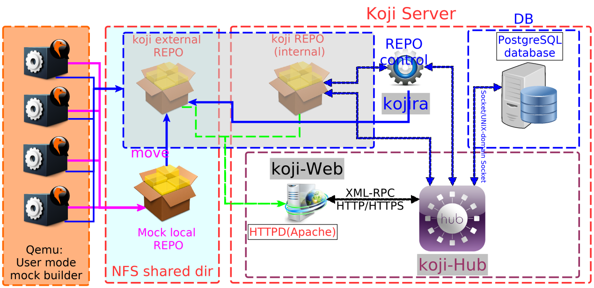

<div align='center' ><font size='20'>koji仓库部署及bootstrap</font></div>


# 初始化一个新的Koji构建环境

***必要条件：**

- Koji Hub已上线，合适的认证机制已配置完成；
- Koji仓库管理守护进程(``kojira``)也已配置好并能运；
- 测试必备条件：最少有一个Koji builder(``kojid``)已被配置好并能运行。

部署一个新Koji服务器以及软件包，使其可用于构建RPM，包含以下几个步骤：

（注：以下所有的koji命令都以Koji系统管理员的身份运行）

## 准备工作：

### 下载并导入现有RPM包

下载所有需要的rpm源码包和您感兴趣的构架对应的二进制 rpm 包。

利用koji/mock编译rpm，其仓库需要满足最小编译环境（rootfs）以及特定软件包本身的编译依赖条件，所以最基本条件是需要有一个150个SRPM（以及相对应的二进制rpm包）左右的最小集合，此集合对于不同构架只有细微差别，这个初始的包集合是需要通过构架bootstrap编译出的，过程复杂，以后用专门文档说明。

我们这里默认构架已经完成了bootstrap过程，需要编译的package也没有缺失编译依赖，只需导入下载的rpm包即可。

#### 导入RPM包（SRPM和对应的RPMs）。

```shell
find riscv64/ -iname '*.rpm' | xargs -n 1 koji import --link
find src/ -iname '*.rpm' | xargs -n 1 koji import --link
```

注：若rpm包和/mnt/koji处同一分区，可通过 ``koji import --link``创建文件的硬链接，以避免将其上传至hub，可以**非常显著地**提高导入速度。**要使用``--link``参数， 你必须root账户。** 强烈建议使用``--link``参数。

### 获得某个release的完整软件包(Package)列表

通过这个包列表我们可以为后期实现自动化任务提交打基础。

#### 通过官方镜像仓库

1. 下载仓库中的\*-filelists.xml.gz文件
   
   1. 镜像列表：https://admin.fedoraproject.org/mirrormanager/
   2. 例如选择163镜像，路径为http://mirrors.163.com/fedora/releases/36/Everything/source/tree/repodata/
   3. 下载其中的*-filelists.xml.gz文件. （注：其实 primary和other也是可以过滤出包列表的，但是filelists文件最小） 

2. 解压gz文件，并过滤出 “\<package pkgid="\*" name="\*" arch="src">”

3. 文本处理，保留`name=`后面的值，这个值的列表就是仓库中包名列表。

#### 通过官方fullfilelist 文件

1. 下载fedoraproject中的fullfilelist文件：https://dl.fedoraproject.org/pub/fedora/fullfilelist 

2. 通过字符处理，得到package列表文件：
   
   ```shell
   grep src.rpm fullfilelist | \
   sed -e 's|^.*linux\/.*\/Packages\/.\/||g' \
   -e 's|-[^-]*-[^-]*.src.rpm$||g' | \
   sort | \
   uniq \
   > full_pkg_list.txt
   ```
   
   通过这个操作可以获得最新的完整package列表。

#### 最佳方法：通过官方koji系统

1. 安装koji：**sudo yum install koji**, __默认配置文件是指向官方koji系统的，无需登陆或证书就可以获取部分发行版信息__，假设我们需要f36的src包列表：

```shell
koji list-tagged --latest --rpms --arch src f36 > f36_src_list.txt
```

2. 通过字符处理，得到package列表文件：

```shell
cat f36_src_list.txt | sed "s/-[^-]*-[^-]*.src$//g" > f36_pkg_list.txt
```

通过这个操作可以动态获得最新的package列表。

### 获取软件分组信息

#### fedora功能分组信息

官方仓库 ： https://pagure.io/fedora-comps

在git clone仓库之后，通过`make all`编译出所有comps文件：comps-*.xml

#### koji编译系统特定的分组信息

使用koji默认配置文件（指向官方koji系统），可以获取特定build tag的分组信息。

```shell
koji show-groups --comps f37-build > comps_f37_koji.xml
```

这个文件基于不同构架可能有不同，但变化不大。这应该是实现最小编译环境（buildroot）的一个好起点。

- __备注：__ 可对 Fedora Koji 实例运行以下命令获取当前 Fedora *build* 组信息：

```shell
koji -s https://koji.fedoraproject.org/kojihub list-groups f37-build
```

## 创建标签（tag）并配置

标签代表着某个release（或者基于这个release的变体/开发版本）所包含的所有软件包集合。

```shell
koji add-tag f36_rv64
```

添加（package）软件包列表（只是包名）到这个tag。

```shell
cat f36_pkg_list.txt | xargs -n 64 koji add-pkg --owner f36_rv64
```

如果你只想包含你已经导入的软件包，操作如下（不推荐）：

```shell
koji list-pkgs --quiet | xargs -n 64 koji add-pkg --owner <kojiuser> f36_rv64
```

## 创建构建标签（build tag）并配置

构建标签（build tag）代表基于其父标签的一个构建环境，所以比起父标签（tag），除了将之前创建的标签作为父标签以继承所有的包列表信息外，还将附带编译需要的构架信息，分组信息等等。

```shell
koji add-tag --parent f36_rv64 --arches "riscv64" f36_rv64_build
koji add-tag-inheritance --priority 1 f36_rv64_build f35_rv64_build
```

### 导入组信息

在已经获取某个标签的 Fedora 的组信息的XML文件后（两个文件，一个是功能组，另一个是koji需要的*-build），将它们批量导入你的构建标签（build tag）：

```shell
koji import-comps comps_f36.xml f36_rv64_build
koji import-comps comps_f36_koji.xml f36_rv64_build
```

手动添加组信息，见[附录](https://lwebapp.com/zh/docx-to-markdown#_手动添加组信息流程)。

## 创建构建目标（build target）

构建目标（build target），描述的是一个构建的过程，其中包含你已经创建的前两个标签：tag和build tag。

```shell
koji add-target f36_rv64_build_target f36_rv64_build f36_rv64
#koji add-target <target name> <build tag> <des tag>
```

## 将导入的软件包(build)打上标签(tag)

### 方法一：list-untagged

通过 ``koji list-untagged`` 来获取刚导入并未打过标签的所有build的列表：

```shell
koji list-untagged | xargs -n 1 koji call tagBuildBypass f36_rv64
```

### 方法二：find

直接通过导入的srpm文件列表获取build列表：

```shell
find src/  -iname '*.rpm'  | \
sed -e 's|^src\/Packages\/.\/||g' \
-e 's|\.src\.rpm$||g'  > \
Builds_list.txt
cat Builds_list.txt | xargs -n 1 koji call tagBuildBypass f36_rv64
```

调用 *tagBuildBypass* 方法（而非使用 ``koji tag-build``）是为了避免 Builder 频繁处理*tagBuild*，而只是直接打上标签。这将会节约很多时间，特别是在给大量软件包大标签的场景。

## 【重/创】建仓库信息（repodata）

```shell
koji regen-repo f36_rv64_build
```

待仓库创建完成，就应该可以进行正常编译了。

# 初始化（Bootstrapping）一个使用外部仓库的新Koji编译环境

给Koji服务器配置一个外部仓库，并使其可被用于编译，需要涉及以下几个步骤。

前提条件与上一节相同。

（注：以下所有的koji命令都以Koji系统管理员的身份运行）

## **准备：**

**拷贝**

## **optional：创建新标签及其构建标签（build tag）**

```shell
koji add-tag f36_rv64_dev
```

并设置你需要的构架信息，并将之前创建的标签作为父标签。

```shell
koji add-tag --parent f36_rv64_dev --arches "riscv64" f36_rv64_dev_build
```

### [导入组信息](https://lwebapp.com/zh/docx-to-markdown#_导入组信息)

## 添加一个外部仓库到构建标签（build tag）

__Koji 会将 \$arch 替换为构建标签中的 arches 。 但 __``$`` 需要转义符__ 以阻止 shell 在传递给 Koji 前将其作为变量翻译。详见以下的外部仓库 URL范例。

```shell
$ koji add-external-repo -t f36_rv64_dev_build f36_rv64_dev_build-external-repo http://koji.tekkmanv.com/path/to/repo/for/foo/\$arch/
#koji add-external-repo [options] <name> [<url>]
#-t TAG, --tag=TAG
#-p PRIORITY, --priority=PRIORITY
#-m MODE, --mode=MODE  Set merge mode(koji/bare/simple)
```

- 注：这里使用的是 \$arch，而非 \$basearch。

### 备注：仓库优先级

__如果需要添加多个外部仓库，koji 会给每个仓库以先入先出（FIFO）的顺序指派一个优先级。这就可能导致更新包可能由于旧包所在的仓库优先级高（数字越小优先级越高）而不可见。__ 请使用``-p``参数指定特定的仓库优先级。

### 备注：外部仓库合并方式

对Koji 基于不同的合并（``merge``） 方式对外部仓库有不同的处理方式。合并可以通过``-m``来设置为以下方式：

##### ``koji``

基本模式 - koji 认为此仓库是完整且不存在混杂内容的，即对于仓库中的任何一个软件包（package）来说，其rpm包都源自同一个SRPM。其生成仓库的操作所执行的 ``mergerepos_c --koji``是通过``dist-repo``命令实现的。（而所有其他来自koji的仓库都有这个属性）

##### ``bare``

它通过 ``mergerepos_c --pkgorigins --all``实现。这会将所有相同包名和构架的包合并进来，**只要版本（version）或发行版本（release）不同就可接受。模块化仓库（modular repos）依赖这一特性。这需要在builder中安装0.14版本及以上的``createrepo_c``，并且其需要在开启libmodule支持下进行编译。就算使用这个选项，在遇到具有相同NEVRA(name-epoch-version-release-arch)的软件包时，只接受首次遇到的rpm。**

##### ``simple``

它通过``mergerepos_c --mode simple``实现 - 这是限制最少的仓库类型。甚至可以接受相同的NEVRA(name-epoch-version-release-arch)的包。简单（Simple） 模式是在0.13版本中引入的 ``createrepo_c``套件的。相对于``bare``模式， 使用这个模式的理由是：

- 你正使用旧版本的 ``createrepo_c``软件，
- 你确实希望让那些相同NEVRA的软件包在仓库中共存。

### 修改外部仓库配置

```shell
koji edit-external-repo --url='https://koji.tekkamanv.com/repos/splited/f36/$arch/' -m koji -t  f36_rv64_dev_build f36_rv64_dev_build-external-repo
#koji edit-external-repo [options] <name>
# --url=URL             Change the url
# --name=NAME           Change the name
#-t TAG, --tag=TAG
#-p PRIORITY, --priority=PRIORITY
#-m MODE, --mode=MODE  Set merge mode(koji/bare/simple)
#-a ARCH1,ARCH2, ..., 
```

### 外部仓库的URL范例

Fedora 最小 buildroots需要下载大约100Mb数据，然后还需要下载编译依赖。这些会在每次编译时被下载，你可通过使用本地镜像或者通过缓存代理来节省大量的网络带宽。

**注意: 这里使用 \$arch 而不是 \$basearch**

Fedora 36

```
https://mirrors.kernel.org/fedora/releases/36/Everything/\$arch/os/
https://mirrors.kernel.org/fedora/updates/36/Everything/\$arch/
```

CentOS 7 和 EPEL

```
https://mirrors.edge.kernel.org/centos/7/os/\$arch/
https://mirrors.edge.kernel.org/centos/7/updates/\$arch/
https://mirrors.kernel.org/fedora-epel/7/\$arch/
```

## **创建一个构建目标（build target）**

使其使用你已经创建的那个build tag。

```shell
koji add-target f36_rv64_dev_build_target   f36_rv64_dev_build f36_rv64_dev
```

此时你可以通过"taginfo"命令验证其外部仓库已经设置完毕。即其已经被列在了"External repos"下。以下是一个添加了一个 F33外部仓库的例子:

```shell
koji taginfo dist-foo-build
```

### 标签和构建目标范例

外部仓库最好配置在子标签中，避免被其他标签继承。

假设一个最简配置：我们仅想基于外部仓库中的包进行编译, 则可能要配置一个简单的标签层次结构：

- [dist-fX-updates] 标签及其目标继承[dist-fX-build]标签，且带外部仓库
- [dist-fX-build]标签也从其他标签继承而来

此时 [dist-fY-build] 或 [dist-fY-updates] 标签不会自动继承 [dist-fX-*] 标签的外部仓库.

#### 标签（tag）

```shell
 dist-f36-updates  - 此为带有f36 release及f36 updates外部仓库的标签
     `- dist-f36-build - 此为带有从dist-f35-build继承而来的'build'和
          |                'srpm-build'分组信息的 f36 编译标签，故其buildroot
          |                得以部署，但无需为每个单独的release来维护分组信息。
         `- dist-f35-build          - etc.
             `- dist-f34-build      - etc.
```

#### 构建目标（build target）

每个 [dist-fX-build] 标签都有一个[dist-fX-updates]子标签(继承了[dist-fX-build])，而每个[dist-fX-updates]标签又有一个相应的 [dist-fX-updates-candidate] 编译目标（build target）。

## **【重/创】建仓库信息（repodata）**

```shell
koji regen-repo f36_rv64_dev_build
```

待仓库创建完成，就应该可以进行正常编译了。

### 关于仓库更新

默认情况下，koji是不会监控外部仓库变化的。管理员可通过在`kojira.conf`中设置

``check_external_repos = true``来使能这个特性 (详见 :doc:`utils`)。如果这个设置没有使能， 重建新仓库的操作就将发生在你给一个buildroot相关的tag中加入一个 build 或者 手动重建仓库。你应确保经常手动重建仓库数据来获取外部仓库的更新。

# Mock（user mode）+ Koji 联合编译仓库参考布局



# **附录**

## 手动添加组信息流程

实践中构建标签（build tag）必须的 *build*组信息有build、srpm-build、appliance-build：

```shell
koji add-group f36_rv64_build build
koji add-group f36_rv64_build srpm-build
koji add-group f36_rv64_build appliance-build
#koji add-group <build tag> <group name>
```

将package添加到相应的 *-build组中：

```shell
koji add-group-pkg f36_rv64_build build pkg1
```

| 组名         | package                                                                                                                                                                                                                                                                                |
| ---------- | -------------------------------------------------------------------------------------------------------------------------------------------------------------------------------------------------------------------------------------------------------------------------------------- |
| build      | bash<br />bzip2<br />coreutils<br />cpio<br />diffutils<br />findutils<br />gawk<br />gcc<br />gcc-c++<br />grep<br />gzip<br />info<br />make<br />patch<br />regulus-release<br />regulus-rpm-config<br />rpm-build<br />sedshadow-utils<br />tar<br />unziputil-linux-ng<br />which |
| srpm-build | bash<br />curl<br />git<br />gnupg<br />make<br />rpm-build<br />shadow-utils<br />regulus-rpm-config<br />regulus-release                                                                                                                                                             |

## koji build 必须的最小环境

最小编译环境需要预先编译出来，包含如下源码包：

| bash               |
| ------------------ |
| gawk               |
| rpm                |
| bzip2              |
| gcc                |
| sed                |
| coreutils          |
| git                |
| regulus-release    |
| tar                |
| cpio               |
| gnupg2             |
| texinfo            |
| curl               |
| grep               |
| unzip              |
| diffutils          |
| gzip               |
| regulus-rpm-config |
| util-linux-ng      |
| findutils          |
| make               |
| patch              |
| which              |