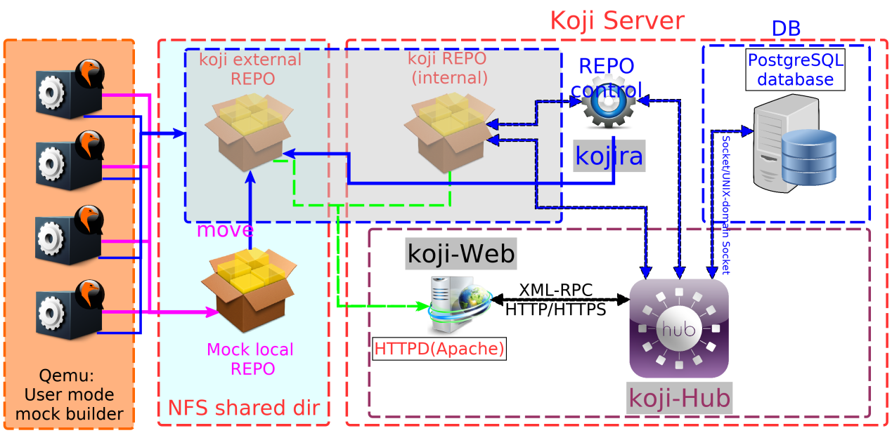

<div align='center' ><font size='20'>Mock辅助编译及仓库测试</font></div>



编译RPM软件包最直接的方法是使用rpmbuild命令在本机进行编译，这样会使用本机的依赖包和相关包的本地修改。但正式的编包必须构建一个“干净的”环境，即直接通过dnf下载安装标准仓库中的依赖包，且不做任何修改地构建一个纯净的编译环境。基于此目的，可用mock命令替代rpmbuild进行软件编译。

Mock是一个用于软件包编译的工具。它可以为（与宿主机）不同的构架和（与宿主机）不同版本的[Fedora](https://getfedora.org/)、[RHEL](https://www.redhat.com/en/technologies/linux-platforms/enterprise-linux)和[Mageia](https://www.mageia.org/) 编译软件包。Mock创建chroots并在其中编译软件包。它唯一的任务就是可靠地部署一个chroot并尝试在其中编译一个软件包。

Mock也提供了一个多包编译命令 (--chain)，它可以编译一系列存在依赖关系的软件包。

如果系统中安装了 mock-scm 包，Mock可以通过__源码配置管理工具（__Source Configuration Management__）__构建SRPMs。请参考文档中的 --scm-enable。

# **简介**

- Mock 是rpmbuild的封装，目的是简化繁琐的编译准备步骤。
- Mock 在一个包含最小软件包集合的隔离环境中运行rpmbuild。
- Mock 会协助您安装所需的BuildRequires - 如果它无法找到所需软件包，则编译失败。
- Mock 可以为不同的平台和构架编译软件包。某些宿主机和目标的组合可能需要额外的配置文件，这取决于您所使用的宿主机平台。
- Mock 会为特定的基于RPM的OS准备一个全新的构建/开发环境。
- Mock 需要root权限执行某些任务，因此恶意RPM包可能威胁您的系统。 Mock 对于未知RPM包并非安全。如果您要构建从不可信的软件源中构建RPM包，则可以使用一些mock的封装，比如OBS、Copr 或者运行Mock的虚拟机。
- Mock 既不是容器也不是虚拟机。Mock做了一些隔离，但并非完全的隔离。Mock 可帮在编译环境（buildroot ）中你打开一个shell以检索软件内容或者运行一些用于调试编译的命令。 所以它不适用于任何生产环境或者应用开发者，你可以使用podman或者Flatpak来实现其他需求。

**构建mock环境的步骤如下：**

# 安装

如果你想要贡献代码，请参考 https://github.com/rpm-software-management/mock。

否则您只需要运行：

```shell
sudo dnf install mock
```


对于最新的持续集成构建版本，请参考[开发者文档](https://github.com/rpm-software-management/mock" \l "nightly)。

- 注意：跨平台编译需要安装qemu-user-static：

```shell
sudo dnf install qemu-user-static
```


# 配置

所有想要使用mock的用户都需要被加入到mock组。

```shell
sudo usermod -a -G mock [User name]
```


__警告：__Mock运行的部分代码需要root权限。有几个已知的方法获取root访问权限，只要用户在mock组中（且只有他可以运行mock). 这可能使用户滥用mock配置选项成为可能。请不要将任何非可信用户加入mock组！

__注意：__以上操作将在用户重新登录或运行“newgrp -”命令后才起效。

Mock会(通过yum_cache插件)缓存下载的rpm包，这可极大加速后续编译。此外你也可通过在默认配置中添加本地仓库来实现加速。

默认配置下，__所有编译结果将保存于/var/lib/mock中__，所以请确保此目录有足够空间用于编译。你也可通过[“basedir”配置选项](https://lwebapp.com/zh/docx-to-markdown#_目录设置)将其指向其他目录。

# 配置文件解析

Mock配置文件可以从逻辑上分为__通用配置__（用于每次mock执行） 和__chroot配置__（只用于指定相关的chroot，见下文）。

通用配置和chroot配置两者都可写在在系统配置 (/etc/mock目录) 或用户配置(文件位于 $HOME/.config 目录)中。

Mock 项目提供了“mock-core-configs”包，其中包含了基于RPM的不同Linux发行版的默认[配置文件](https://rpm-software-management.github.io/mock/configuration) 。这个软件包通常会随Mock（作为运行时依赖）被一同安装。其他项目可通过额外的软件包提供配置文件，例如：

- [mock-centos-sig-configs](https://pagure.io/centos-sig-hyperscale/mock-centos-sig-configs)

## 指定chroot配置文件

例如初始化一个 Fedora Rawhide x86_64 chroot (使用/etc/mock/fedora-rawhide-x86_64.cfg 文件), 并切换到 chroot中（的shell环境），可做如下操作：

```shell
$ mock **-r fedora-rawhide-x86_64** --shell
```


注意，此处我们没有在-r参数中指明.cfg后缀。**此时，将先搜索用户$HOME/.config目录中的相关.cfg文件，若未找到，则将搜索系统配置/etc/mock目录中的文件(并使用)。**

也可在“-r”选项中使用一个配置文件路径。但路径名必须代表一个已存在的文件(可从当前工作目录中访问)，**且必须以‘.cfg’为后缀**:

```shell
$ mock -r ./subdir/existing-config-file.cfg --shell
$ mock -r /etc/mock/fedora-35-x86_64.cfg
```


## 调整通用配置

通常，__$HOME/.config/mock.cfg__文件应该被用于针对单用户的通用配置修改。如需修改系统的Mock行为(对于系统所有用户)，则使用 /etc/mock/site-defaults.cfg。

通常site-defaults.cfg文件默认是空的，而只包含基本文档和 一个指向完整配置文档的有效链接。那个文档通常是__/usr/share/doc/mock/site-defaults.cfg __(基于你的宿主机系统的不同，位置可能不同)。

## 调整chroot配置

用于各种编译环境的chroot配置文件/etc/mock/.cfg，包含了各种与目标发行版相关的兼容设置（包含使用DNF或YUM时的RPM仓库地址、所使用的工作目录等等）。这些系统文件是通过[mock-core-configs](https://src.fedoraproject.org/rpms/mock-core-configs) (或其他软件包)发布的，且不提倡用户改变其内容（可能导致这些文件在随着软件包自动更新时出现问题）。

建议通过以下方式覆盖其内容较为安全:

```shell
$ cat $HOME/.config/mock/fedora-35-x86_64.cfg
# include the default configuration
include("/etc/mock/fedora-35-x86_64.cfg")
# install make into the minimal build chroot
config_opts['chroot_additional_packages'] = 'make'
```


你也可以拷贝并编辑已有的配置文件到新的配置文件：

```shell
$ cp /etc/mock/fedora-rawhide-x86_64.cfg ~/.config/mock/foo.cfg
```


若Koji中已存在一个所需的配置，你可以用Koji命令行工具生成这个配置文件：

```shell
$ koji mock-config --tag f21-build --arch=aarch64 f21 > ~/.config/mock/foo.cfg
```


同样的功能也存在于Copr命令行工具中：

```shell
$ copr mock-config @copr/copr-dev fedora-21-x86_64 > ~/.config/mock/foo.cfg
```


当完成配置文件的安装，你就可以：

```shell
mock -r foo [...].
```


## 配置导入顺序

Mock中的配置文件的导入和覆盖顺序如下（[相关代码](https://github.com/rpm-software-management/mock/blob/main/mock/py/mockbuild/config.py)）：

1. 全局配置（默认文件无有效配置，文档性文件）：
   1. 通用配置：/etc/mock/site-defaults.cfg
   2. chroot配置：/etc/mock/chroot-aliases.cfg
2. chroot配置（按顺序优先，__三选一__）：
   1. 命令行参数指定路径，并以`.cfg`为后缀的文件
   2. 用户配置：~/.config/mock/.cfg
   3. 全局配置：/etc/mock/.cfg
3. 用户特有配置：
   1. ~/.mock/user.cfg
   2. ~/.config/mock.cfg (从mock-1.2.15开始)

**后导入的配置文件中的值会覆盖先导入配置。**

# **qemu user mode Mock build 配置**

比如，为Fedora 37 编译riscv64构架的rpm包，配置文件如下：

**/etc/mock/fedora-37-riscv64.cfg**

```shell
config_opts['releasever'] = '37'
config_opts['target_arch'] = 'riscv64'
config_opts['legal_host_arches'] = ('riscv64',)

include('templates/fedora-branched.tpl')
```


如果是 RawHide版本则为__(文档编写时的rawhide版本为38)__：

**/etc/mock/fedora-38-riscv64.cfg**

```shell
config_opts['target_arch'] = 'riscv64'
config_opts['legal_host_arches'] = ('riscv64',)

include('templates/fedora-rawhide.tpl')
```


对于还未受到官方主线支持的构架(如例中的riscv64)，templates中文件包含的仓库配置可能无法满足编译。此时根据[配置导入顺序](https://lwebapp.com/zh/docx-to-markdown#_配置导入顺序)，需要对“用户特有配置：”中的文件进行修改，用正确的仓库信息覆盖原先导入的信息。例如：

**~/.mock/user.cfg 或 ~/.config/mock.cfg 文件内容：**

```shell
include('/etc/mock/templates/fedora-37-riscv64-repo.tpl')
```


**/etc/mock/templates/fedora-37-riscv64-repo.tpl文件内容：**

```shell
config_opts['bootstrap_image'] = ''

config_opts['dnf.conf'] = """
[main]
keepcache=1
debuglevel=2
reposdir=/dev/null
logfile=/var/log/yum.log
retries=20
obsoletes=1
gpgcheck=0
assumeyes=1
syslog_ident=mock
syslog_device=
install_weak_deps=0
metadata_expire=0
best=1
module_platform_id=platform:f{{ releasever }}
protected_packages=
user_agent={{ user_agent }}

# repos

[fedora-37-dist-riscv]
name=Fedora 37 RISC-V dist on OpenKoji
baseurl=https://openkoji.iscas.ac.cn/repos/fc37dist/$basearch/
cost=1000
enabled=1
skip_if_unavailable=False

[fedora-36-dev-riscv]
name=Fedora 36 RISC-V dev on OpenKoji
baseurl=https://openkoji.iscas.ac.cn/repos/fc36dev/$basearch/
cost=2000
enabled=1
skip_if_unavailable=True

[fedora-36-dev-riscv-source]
name=Fedora 36 RISC-V dev on OpenKoji - Source
baseurl=https://openkoji.iscas.ac.cn/repos/fc36dev/src/
cost=2000
enabled=1
skip_if_unavailable=True
"""
```


# **编译参考流程**

创建工作环境

```shell
MOCK_CONFIG=fedora-36-riscv64
WORK_DIR=/mnt/nfs/${MOCK_CONFIG}
LOCAL_REPO=/mnt/nfs/${MOCK_CONFIG}-localrepo/
DEVEL_REMOTE=origin
DEVEL_BRANCH=rvf36
CMT_MESSAGE='Add source code tarball to repo.'
BUILD_TAG=f36dev
```


假设我们的代码下载于此，也就是工作仓库：__/mnt/nfs/${MOCK_CONFIG}-repo __

```shell
PKG_NAME=zlib
cd $WORK_DIR
mkdir -p $PKG_NAME
git clone git@gitee.com:src-oepkgs-fedora-rv/$PKG_NAME.git $PKG_NAME/$PKG_NAME
pushd $PKG_NAME/$PKG_NAME
git checkout f36
######以下是为了在编译时可以不需要下载源码，######
######保证编译顺利进行，不会因为源码下载失败而出错 ######
git checkout -b $DEVEL_BRANCH;
spectool -g $PKG_NAME.spec
#如果下载失败请使用以下命令
#fedpkg source
#检查是否下载了所有的源码
SRC_FILE=`cat sources | awk '{printf $2}' | sed -e 's/(//g' -e 's/)/ /g'`
git add -f $SRC_FILE
git rm sources
git commit -am "$CMT_MESSAGE"; git push $DEVEL_REMOTE $DEVEL_BRANCH
###### end ######
koji add-pkg --owner=kojiadmin ${BUILD_TAG} $PKG_NAME;
cd ..
env G_SLICE=always-malloc \
mock -r ${MOCK_CONFIG} \
--buildsrpm \
--spec $(basename $PWD)/$(basename $PWD).spec \
--source $(basename $PWD) && cp -vf /var/lib/mock/${MOCK_CONFIG}/result/$(basename $PWD)*src.rpm .

env G_SLICE=always-malloc \
mock -r ${MOCK_CONFIG} \
--localrepo ${LOCAL_REPO} \
--recurse --chain \
$(basename $PWD)*src.rpm
```


- __--cleanup-after__：在编译完成后清理编译现场
- __--nocheck __：跳过最后的%check阶段，对于某些test不过的riscv包可以临时出包解决依赖问题。
- __-D 'dist .f36'：__临时定义dist字段，对于早期rpm配置宏还不完整的情况下有帮助。

如果编译失败，污染了编译环境，或者仓库缓存中有旧包（同版本或者低版本）影响了编译，可以通过以下命令清理编译环境。

```shell
env G_SLICE=always-malloc mock -r fedora-36-riscv64 --cleanup-after --scrub=all
```


# **编译完成后的结果处理**

在编译完成后，在可以将结果导入仓库，如将rpm从 ${__LOCAL_REPO__}拷贝到external repo 中, 并更新仓库：

```shell
createrepo -v --update ${external_repo_path}
```


然后通过

```shell
koji -q --skip-main regen-repo --nowait  ${BUILD_TAG}
```


更新相应tag的仓库

# **有koji任务提交权限的账户，也可直接提交任务到koji：**

```shell
koji build --nowait $BUILD_TAG git+ssh://git@gitee.com/src-oepkgs-fedora-rv/$PKG_NAME.git#$(git rev-parse $DEVEL_REMOTE/$DEVEL_BRANCH)
```


客户端 (koji-builder)

mock

setarch (for some archs you'll require a patched version)

rpm-build

createrepo

# 附录：mock配置详解【site-defaults.cfg翻译重排】

## 配置文件分类

__全局配置文件：__site-defaults.cfg，应用于宿主机，包含所有配置默认值，其中指定的__配置选项将会被用户各自的mock配置文件覆盖__。

- /etc/mock/site-defaults.cfg：软件包自带配置文件，默认是没有设置任何配置选项的，仅当你想覆盖某些默认配置时才需要在此设置。
- /usr/share/doc/mock/site-defaults.cfg：属于介绍性文档。

__用户配置文件__：~/.config/mock.cfg

## 配置文件语法

### “include”语句

声明包含其他配置文件：

**include('/path/to/included/config.cfg')**

### 配置项格式

**config_opts['foo'] = 'bar'**

可以使用jinja模板，比如：**config_opts['foobar'] = '{{ foo }} bar'**

(使用以上的定义)其结果为__'bar bar'__ 。

较复杂的例子：

**config_opts['foo'] = "{{ plugin_conf['package_state_enable'] }}"**

其结果为 "True"

## 全局site-defaults.cfg中推荐使用的设置

### 目录设置

```shell
config_opts['basedir'] = '/var/lib/mock/'
config_opts['cache_topdir'] = '/var/cache/mock'
```


注: basedir 和 cache_topdir 指向的路径，其属主必须为'mock'组，且权限必须为“g+rws”

### 超时设置

```shell
config_opts['rpmbuild_timeout'] = 0
```


### 网络设置

使用__“--enable-network”__会设__use_host_resolv__为__True，__可用以下方式修改：

```shell
config_opts['use_host_resolv'] = False
```

### 日志设置

可通过以下配置日志格式，从/etc/mock/logging.ini中获取这些名字（keys）对应的格式：

[formatters]

keys: **detailed**,**simple**,**unadorned**,**state**

```shell
config_opts['build_log_fmt_name'] = "unadorned"
config_opts['root_log_fmt_name']  = "detailed"
config_opts['state_log_fmt_name'] = "state"
```


默认情况下, mock（只）会将build log输出到（tty的）stderr。可通过设置以下为True强制其输出(应用场景，如在CI编译环境中没有tty)，或设为False强制关闭输出。注释掉这个选项或者将其设为None，则为默认设置。

```shell
config_opts['print_main_output'] = None
```


这个选项用于设置build.log文件中stderr的输出前缀。默认为空字符串。

```shell
config_opts['stderr_line_prefix'] = ""
```


### 设备结点相关设置

mock通常会为chroot设置一个最小的/dev。若想用一个预先配置好的/dev，需禁用此选项并使用[bind-mount插件](#_bind mount 插件)来挂载定制的/dev。

```shell
config_opts['internal_dev_setup'] = True
```


loop设备的默认最大数量12

```shell
config_opts['dev_loop_count'] = 12
```


### 目录清理设置

cleanup_on_* 选项让系统可自动清理和删除mock的编译目录，但仅在和“--resultdir”一起使用时有效。相较于命令行选项这种粗犷的控制模式，**config_opts则提供了一种精细控制模式。**

```shell
config_opts['cleanup_on_success'] = True
config_opts['cleanup_on_failure'] = True
```


为了防止来自上次编译过程中的垃圾影响接下来的编译，即使使用了“--no-clean”，编译用户的homedir也会被部分清理。

Mock可配置为不清理特定的文件/目录，其默认配置为SOURCES目录以支持nosrc rpm编译。路径是相对于用户的homedir build。

```shell
config_opts['exclude_from_homedir_cleanup'] = ['build/SOURCES']
```


若需要mock在清理前备份结果文件夹（result dir）的内容，可用以下配置

```shell
config_opts['backup_on_clean'] = False
config_opts['backup_base_dir'] = "{{basedir}}/backup"
```


### 隔离模式（容器相关）设置

选择在buildroot中运行命令的隔离模式。可能的值有'nspawn'(mock使用systemd-nspawn(1)), 'simple'(简单地使用os.chroot()或者'auto'(若有可能，使用'nspawn'，否则退而使用'chroot')。

```shell
config_opts['isolation'] = 'auto'
```


#### **'nspawn'**

若使用isolation='nspawn'，则对于rpmbuild，网络是默认关闭的，目的是为了保证编译的可重现性。

```shell
config_opts['rpmbuild_networking'] = False
```


针对nspawn的额外参数为

```shell
config_opts['nspawn_args'] = ['--capability=cap_ipc_lock']
```


#### __hostname __

当RPM 在容器中编译时，编译时的hostname 将被设置成容器名。以下可设置编译时的hostname为容器宿主机名，仅适用于F25以上的chroots。

```shell
config_opts['use_container_host_hostname'] = True
```


这个设置无条件地调用sethostname()实现hostname的设置，但尽管如此变量use_container_host_hostname或%_buildhost宏可覆盖此设置。

```shell
config_opts['hostname'] = 'my.own.hostname'
```


#### **docker_unshare_warning**

Mock默认是不共享用户空间的，这与其他在非特权容器中的应用忽略此特性有所不同。mock将显示警告信息，将mock与其他应用运行与同一个容器并不妥当且存在安全风险。如果你已知其安全风险，或mock是你在其容器中的唯一应用，则可通过以下选项关闭警告。

```shell
config_opts['docker_unshare_warning'] = True
```


### 包管理器相关设置

默认包管理器为DNF。

如果要使用DNF, 请设为'dnf'。此时系统必须安装dnf 和dnf-plugins-core。

```shell
config_opts['package_manager'] = 'dnf'
```


执行包管理器操作的尝试次数和两次操作间的间隔（秒）。此设置用于，例如，编译使用了不可靠仓库镜像站点（下载元数据失败，下载软件包失败...）

```shell
config_opts['package_manager_max_attempts'] = 1
config_opts['package_manager_attempt_delay'] = 10
```


如需要使用与主系统本版不同的包管理器，可设置Yum、DNF、rpm和rpmbuild可执行文件的路径：

```shell
config_opts['yum_command'] = '/usr/bin/yum'
config_opts['yum_builddep_command'] = '/usr/bin/yum-builddep'
config_opts['dnf_command'] = '/usr/bin/dnf'
config_opts['rpm_command'] = '/bin/rpm'
config_opts['rpmbuild_command'] = '/usr/bin/rpmbuild'
```

默认情况下Yum/DNF升级会在每次编译前执行：

```shell
config_opts['update_before_build'] = True
```


#### resultdir仓库生成

若要mock对您resultdir中的rpm包自动运行createrepo，可修改以下配置

```shell
config_opts['createrepo_on_rpms'] = False
config_opts['createrepo_command'] = '/usr/bin/createrepo_c -d -q -x *.src.rpm'
```


#### bootstrap

有时宿主机的rpm/yum/dnf 环境并不一定兼容（我们所要编译的系统的）mock chroot中的 rpm/yum/dnf 环境。通常，当宿主机是基于 yum 的系统，而目标系统是基于dnf的，这种场景下可能在准备目标mock buildroot 时出错，甚至更糟的是产生不可预期且不易察觉的安装操作。

因此在默认 `use_bootstrap=True` 的情况下，我们先安装一个最小的"bootstrap"

chroot, 其中仅包含rpm/yum/dnf 软件栈，然后我们以这个"bootstrap" chroot

为基础初始化目标chroot。

```shell
config_opts['use_bootstrap'] = True
```


当 'use_bootstrap' 被使能，这些命令可被用于安装我们所期望的包管理器到"bootstrap" chroot。

```shell
config_opts['yum_install_command'] = 'install yum yum-utils'
config_opts['dnf_install_command'] = 'install dnf dnf-plugins-core'
config_opts['system_yum_command'] = '/usr/bin/yum'
config_opts['system_dnf_command'] = '/usr/bin/dnf'
```

bootstrap chroot通常由宿主机使用包管理器安装，但是某些情况下则无法实现。（例如在 epel-7宿主机上通过'dnf_install_command'安装很新的 ZSTD 压缩的 dnf.rpm 包）。这种情况下，可能需要预先通过一个容器镜像（其中的包管理器已被预先安装，而无需mock再处理）部署 "bootstrap" chroot。

```shell
config_opts['use_bootstrap_image'] = False
config_opts['bootstrap_image'] = 'fedora:latest'
```


任何以'bootstrap_*' 格式定义的配置将会被复制到bootstrap配置中，例如

```shell
config_opts['bootstrap_system_yum_command'] ='/usr/bin/yum-deprecated'
```

将会变成bootstrap config中的

```shell
config_opts['system_yum_command'] = '/usr/bin/yum-deprecated'
```


由于通常不会在bootstrap chroot中添加额外的包和模块，以下配置会在bootstrap中被默认值覆盖。

```shell
config_opts['bootstrap_chroot_additional_packages'] = []
config_opts['bootstrap_module_setup_commands'] = []
```


### 编译依赖设置

动态编译依赖(BuildRequires)，RPM 4.15及以上版本支持。

```shell
config_opts['dynamic_buildrequires'] = True
config_opts['dynamic_buildrequires_max_loops'] = 10
```


允许使用外部编译依赖（external buildrequires），如当依赖需用PyPI, Rubygems安装

```shell
config_opts['external_buildrequires'] = False
```


### tar相关设置

Mock使用的tar程序二进制路径保存在config_opts['tar_binary'] 中。 Mock 会将一组不同的命令行选项应用于tar命令，可用的选项有"gnutar"或"bsdtar" (被root cache和SCM插件使用，但也被Mock核心程序用于同--use-bootstrap-image选项配合解包Podman容器文件系统)。

```shell
config_opts['tar_binary'] = "/bin/tar"
config_opts['tar'] = "gnutar"
```


### nosync设置

如果需要加速包的安装和编译过程，mock可以使用nosync库来跳过来自mock程序内部的fsync以及相关的调用。这需要安装nosync库，且对于multilib目标，所有构架都需要存在nosync 库支持。如果不满足条件，这将无法使能。

```shell
config_opts['nosync'] = False
```


若即不想安装所有构架的nosync 支持库，但又希望mock使用它，虽可强制使能此项，但当执行32bit程序时将会有许多来自ld.so的（一般无害的）错误信息。

```shell
config_opts['nosync_force'] = False
```


### 结果保存目录设置

Resultdir 选项可设置结果文件（RPMs和编译日志）的写入目录，其可包含chroot 配置中的任何可替换的python字符串变量

```shell
config_opts["resultdir"] = "{{basedir}}/{{root}}/result"
```


## 插件相关配置

以下是默认配置，请根据宿主机(站点的)规则来调整。site-defaults.cfg是一个实现的好地方。注意: 某些缓存选项理论上可能影响编译的可重现性，谨慎修改。

```
config_opts['plugin_conf']['package_state_enable'] = True
config_opts['plugin_conf']['package_state_opts'] = {}
config_opts['plugin_conf']['package_state_opts']['available_pkgs'] = False
config_opts['plugin_conf']['package_state_opts']['installed_pkgs'] = True
config_opts['plugin_conf']['ccache_enable'] = False
config_opts['plugin_conf']['ccache_opts'] = {}
config_opts['plugin_conf']['ccache_opts']['max_cache_size'] = '4G'
config_opts['plugin_conf']['ccache_opts']['compress'] = None
config_opts['plugin_conf']['ccache_opts']['dir'] = "{{cache_topdir}}/{{root}}/ccache/u{{chrootuid}}/"
config_opts['plugin_conf']['yum_cache_enable'] = True
config_opts['plugin_conf']['yum_cache_opts'] = {}
config_opts['plugin_conf']['yum_cache_opts']['max_age_days'] = 30
config_opts['plugin_conf']['yum_cache_opts']['max_metadata_age_days'] = 30
config_opts['plugin_conf']['yum_cache_opts']['online'] = True
config_opts['plugin_conf']['root_cache_enable'] = True
config_opts['plugin_conf']['root_cache_opts'] = {}
config_opts['plugin_conf']['root_cache_opts']['age_check'] = True
config_opts['plugin_conf']['root_cache_opts']['max_age_days'] = 15
config_opts['plugin_conf']['root_cache_opts']['dir'] = "{{cache_topdir}}/{{root}}/root_cache/"
config_opts['plugin_conf']['root_cache_opts']['compress_program'] = "pigz"

decompress_program 仅用于bsdtar解压过程。对于bsdtar，缺省情况下（未设置decompress_program），解压过程由`compress_program`和`-d`配合完成，最终由 "unpigz" 或 "gunzip"实现。

config_opts['plugin_conf']['root_cache_opts']['decompress_program'] = "pigz"
config_opts['plugin_conf']['root_cache_opts']['extension'] = ".gz"
config_opts['plugin_conf']['root_cache_opts']['exclude_dirs'] = ["./proc", "./sys", "./dev", "./var/tmp/ccache", "./var/cache/yum", "./var/cache/dnf", "./var/log" ] 
config_opts['plugin_conf']['hw_info_enable'] = True
config_opts['plugin_conf']['hw_info_opts'] = {}
config_opts['plugin_conf']['procenv_enable'] = False
config_opts['plugin_conf']['procenv_opts'] = {}
config_opts['plugin_conf']['showrc'] = False
config_opts['plugin_conf']['showrc'] = {}
config_opts['plugin_conf']['tmpfs_enable'] = False
config_opts['plugin_conf']['tmpfs_opts'] = {}
config_opts['plugin_conf']['tmpfs_opts']['required_ram_mb'] = 1024
config_opts['plugin_conf']['tmpfs_opts']['max_fs_size'] = '768m'
config_opts['plugin_conf']['tmpfs_opts']['mode'] = '0755'
config_opts['plugin_conf']['tmpfs_opts']['keep_mounted'] = False
config_opts['plugin_conf']['chroot_scan_enable'] = False
config_opts['plugin_conf']['chroot_scan_opts'] = {'regexes': [ "^[^k]?core(\.\d+)?", "\.log$",], 'only_failed': True,}

'regexes'：为从buildroot 拷贝到resultdir的文件名正则表达式。
only_failed：若为True，则文件仅在编译失败时拷贝。
```


### bind mount 插件

bind mount 插件默认是使能的，但默认并未配置挂载目录

```shell
config_opts['plugin_conf']['bind_mount_enable'] = True
config_opts['plugin_conf']['bind_mount_opts']['dirs'].append(('/host/path', '/bind/mount/path/in/chroot/' ))
```


### lvm_root 插件

lvm_root插件默认是禁用状态，其状态传递到其余的子包mock-lvm。若需使用，建议禁用root_cache 插件，否则将缓存两次。

```shell
config_opts['plugin_conf']['lvm_root_enable'] = False
config_opts['plugin_conf']['lvm_root_opts'] = {}
```


接下来，必须为其提供一个卷组及充足的空间。它不会使用任何已存在的逻辑卷，故可使用你为其他目的已启用的同一卷组。此处需要VG名 (并非设备节点路径).

指定mock的精简池所占据的大小：

对于依赖较少的普通软件包，2G应该够了。

对于如libreoffice这样的大规模软件包，最少需要设置5GB，否则将由于空间耗尽而导致编译过程受阻。

```shell
config_opts['plugin_conf']['lvm_root_opts']['volume_group'] = 'my_vg'
config_opts['plugin_conf']['lvm_root_opts']['size'] = '2G'
```


可指定可选的池元数据大小，格式和“size”一致，默认值由lvcreate的size来决定。

```shell
config_opts['plugin_conf']['lvm_root_opts']['poolmetadatasize'] = None
```


当精简池利用率超过90%，mock将停止工作。因为一旦利用率达到100%将会触发各种奇怪的问题：

```shell
config_opts['plugin_conf']['lvm_root_opts']['check_size'] = True
```

指定在mock退出后，buildroot使用的卷是否应该保持挂载状态。

```shell
config_opts['plugin_conf']['lvm_root_opts']['umount_root'] = False
```

lvm卷所使用的文件系统格式。系统将使用mkfs.$filesystem工具格式化文件系统。

```shell
config_opts['plugin_conf']['lvm_root_opts']['filesystem'] = "ext4"
```

创建文件系统的完整命令将会获取卷的路径作为参数。若此处被设置，将覆盖上述配置

```shell
config_opts['plugin_conf']['lvm_root_opts']['mkfs_command'] = None
```

传递给mkfs命令的额外参数。

```shell
config_opts['plugin_conf']['lvm_root_opts']['mkfs_args'] = []
```

在挂载卷的时候，此参数将会传递给mount的-o选项，可设为字符串或None。

```shell
config_opts['plugin_conf']['lvm_root_opts']['mount_opts'] = None
```

完成LVM初始化的等待时间。

```shell
config_opts['plugin_conf']['lvm_root_opts']['sleep_time'] = 1
```

### overlayfs 插件

由于overlayfs插件隐式地在创建后初始化（postinit）快照（类似lvm_root插件），这使得root cache毫无意义，故建议在使能overlayfs插件时禁用root_cache插件。(建议和config_opts['plugin_conf']['root_cache_enable'] = False一同配置)

```shell
config_opts['plugin_conf']['overlayfs_enable'] = False
config_opts['plugin_conf']['overlayfs_opts']['base_dir'] = /some/directory
config_opts['plugin_conf']['overlayfs_opts']['touch_rpmdb'] = False
```

### pm_request 插件

pm_request插件可在buildroot中安装需要的软件包。此插件默认是禁用的，因为这会影响编译的可重现性。可通过设以下选项为True来启用它。但不建议全局启用此项。最佳实践是在单次编译时使用‘__--enable-plugin pm_request’__来启动该插件。

```shell
config_opts['plugin_conf']['pm_request_enable'] = False
config_opts['plugin_conf']['pm_request_opts'] = {}
```

### 日志压缩插件

若需压缩mock日志，则可使能此插件。

```shell
config_opts['plugin_conf']['compress_logs_enable'] = False
```

用于压缩日志的命令 - 例如 "/usr/bin/xz -9 --force"

```shell
config_opts['plugin_conf']['compress_logs_opts']['command'] = "gzip"
```

### 签名插件

签名插件的配置选项:

```shell
config_opts['plugin_conf']['sign_enable'] = False
config_opts['plugin_conf']['sign_opts'] = {}
config_opts['plugin_conf']['sign_opts']['cmd'] = 'rpmsign'
```

提供给签名命令的选项。 %(rpms)s 将会被扩展为结果目录下的rpm名。

```shell
config_opts['plugin_conf']['sign_opts']['opts'] = '--addsign %(rpms)s -D "%%_gpg_name your_name" -D "%%_gpg_path /home/your_name/.gnupg"'
```

### rpkg插件

在srpm编译前，通过使用rpkg工具，使能预处理步骤

```shell
config_opts['plugin_conf']['rpkg_preprocessor_enable'] = False
config_opts['plugin_conf']['rpkg_preprocessor_opts']['requires'] = ['preproc-rpmspec']
config_opts['plugin_conf']['rpkg_preprocessor_opts']['cmd'] = '/usr/bin/preproc-rpmspec %(source_spec)s --output %(target_spec)s'
```

## chroot环境变量

```shell
config_opts['environment']['TERM'] = 'vt100'
config_opts['environment']['SHELL'] = '/bin/bash'
config_opts['environment']['HOME'] = '/builddir'
config_opts['environment']['HOSTNAME'] = 'mock'
config_opts['environment']['PATH'] = '/usr/bin:/bin:/usr/sbin:/sbin'
config_opts['environment']['PROMPT_COMMAND'] = r'printf "\033]0;<mock-chroot>\007"'
config_opts['environment']['PS1'] = r'<mock-chroot> \s-\v\$ '
config_opts['environment']['LANG'] = 'C.UTF-8'
```

### PS1范例

```shell
config_opts['environment']['PS1'] = r'[\u@\h<mock-chroot>/\w]\[\033[01;31m\]${?/#0/}\[\033[00m\]\$'
```

你可以在这个网站 http://bashrcgenerator.com/ 生成自己的配置

## 修改需谨慎（不建议修改）

```shell
config_opts['chroothome'] = '/builddir'
config_opts['clean'] = True
```

此处无法使用变量替换，故改写此处恐将无法正常工作：

```shell
config['rootdir'] = '/var/lib/mock/<CONFIG>/root/'
```

F25以上版本的 chroots 有效。其覆盖了'use_container_host_hostname' 的配置。

```shell
config_opts['macros']['%_buildhost'] = 'my.own.hostname'
```

## 针对SCM的配置调整

```shell
config_opts['scm'] = True
config_opts['scm_opts']['method'] = 'git'
config_opts['scm_opts']['cvs_get'] = 'cvs -d /srv/cvs co SCM_BRN SCM_PKG'

若添加"--recurse-submodules"或"--recursive"选项，则git仓库中的子模块也将被检出。

config_opts['scm_opts']['git_get'] = 'git clone SCM_BRN git://localhost/SCM_PKG.git SCM_PKG'
config_opts['scm_opts']['svn_get'] = 'svn co file:///srv/svn/SCM_PKG/SCM_BRN SCM_PKG'
config_opts['scm_opts']['distgit_get'] = 'rpkg clone -a --branch SCM_BRN SCM_PKG SCM_PKG'
config_opts['scm_opts']['distgit_src_get'] = 'rpkg sources'
config_opts['scm_opts']['spec'] = 'SCM_PKG.spec'
config_opts['scm_opts']['ext_src_dir'] = '/dev/null'
config_opts['scm_opts']['write_tar'] = True
config_opts['scm_opts']['git_timestamps'] = True
config_opts['scm_opts']['exclude_vcs'] = True

以下选项也会被识别生效，但通常定义在命令行中：

--scm-option package=<pkg> --scm-option branch=<branch>
config_opts['scm_opts']['package'] = 'mypkg'
config_opts['scm_opts']['branch'] = 'main'
```

## 独立chroot 配置文件最佳实践

### 必要设置 :

```shell
config_opts['root'] = 'name-of-yum-build-dir'
```

Mock将使用特有的(2) syscall设置构架信息于 'target_arch' 。

```shell
config_opts['target_arch'] = 'riscv64'
```

当宿主机系统构架不在__'legal_host_arches'列表__中时，mock将拒绝切换到'target_arch'并将触发错误.

```shell
config_opts['legal_host_arches'] = ('i386', 'i586', 'i686', 'x86_64','riscv64')
```

#### 关于$CHROOT/etc/yum/yum.conf或$CHROOT/etc/dnf/dnf.conf包含的内容

在缺少'dnf.conf'配置的情况下使用DNF，则 'yum.conf'的内容将被填入到$CHROOT/etc/dnf/dnf.conf中，反之亦然。但config_opts['yum.conf'] = ''或 config_opts['dnf.conf'] = ''这两个配置是二选一的，不应同时使用。

**特别提醒：必须在yum/dnf.conf中使用'assumeyes=1'，否则Mock编译将会失败。**

以下配置用于DNF，且可用于dnf.conf中作变量替换$key，其值将被换入。

```shell
config_opts['dnf_vars'] = { 'key': 'value', 'key2': 'value2' }
```

若要去除系统不支持所需包管理器（例如，主机中仅有Yum支持，但所选buildroot需通过Dnf安装）的警告信息，可将以下配置设为False。

```shell
config_opts['dnf_warning'] = True
```

警告！若其为False将使RHEL{6,7}平台自动使用Yum。

### 可选配置

以下配置为可选配置，默认配置一般就可用:

```shell
config_opts['chroot_setup_cmd'] = 'install @buildsys-build'

@buildsys-build 是Fedora发行版定义在comps中的组。 
对于chroot_setup_cmd，实际需要以下软件包：
shadow-utils - mock 需要此包中的 /usr/sbin/useradd
rpm-build - mock 需要 /usr/bin/rpmbuild
glibc-minimal-langpack - 可选, 可避免安装庞大的glibc-all-langpacks。

config_opts['chroot_additional_packages'] = ''
config_opts['log_config_file'] = 'logging.ini'
config_opts['more_buildreqs']['srpm_name-version-release'] = 'dependency'
config_opts['more_buildreqs']['srpm_name-version-release'] = ['dependency1', 'dependency2']
config_opts['macros']['%Add_your_macro_name_here'] = "add macro value here"
config_opts['files']['path/name/no/leading/slash'] = "put file contents here."
config_opts['chrootuid'] = os.getuid()
config_opts['releasever'] = '20'
config_opts['dnf_disable_plugins'] = ['local', 'spacewalk', 'versionlock']
config_opts['yum_common_opts'] = []
config_opts['dnf_common_opts'] = ['--setopt=deltarpm=False', '--allowerasing']
config_opts['yum_builddep_opts'] = []
config_opts['dnf_builddep_opts'] = []
config_opts['microdnf_command'] = '/usr/bin/microdnf'

"dnf-install" 是特定关键字，告知 mock 使用DNF安装软件

config_opts['microdnf_install_command'] = 'dnf-install microdnf dnf dnf-plugins-core'
config_opts['microdnf_builddep_command'] = '/usr/bin/dnf'
config_opts['microdnf_builddep_opts'] = []
config_opts['microdnf_common_opts'] = []
config_opts['priorities.conf'] = 'put file contents here.'
config_opts['rhnplugin.conf'] = 'put file contents here.'

config_opts['subscription-manager.conf'] = 'put file contents here.'
企业版配置，必须先注册宿主机

这仅适用于DNF，且当仓库在dnf.conf中配置了modules=1。
在初始化chroot时，先于`chroot_setup_cmd`执行的模块命令列表。每个命令是一对配置，如 `(action, module_specs)`，`module_specs`是一个由逗号作为分隔符的模块说明列表命令是按配置的顺序执行，且每个`action`可以多次执行。示例: 
a.关闭任何潜在已使能的postgresql模块流;
b.使能 _特定的_ postgresql以及ruby模块流;
c.安装开发版本 nodejs 并and (d) 立即禁用它。

config_opts['module_setup_commands'] = [
    ('disable', 'postgresql'),
    ('enable',  'postgresql:12, ruby:2.6'),
('install', 'nodejs:13/development'),
('disable', 'nodejs'),
]

使用以下选项强制为某个特定构架编译 (必须安装 qemu-user-static)

config_opts['forcearch'] = None

模拟构架会导致编译缓慢，需要将其暴露给打包工程师，正常设为1，当使用forcearch时设为10。

config_opts['macros']['%_platform_multiplier'] = 1
```

### 用户名相关

```shell
config_opts['chrootgid'] = grp.getgrnam("mock")[2]
config_opts['chrootuser'] = 'mockbuild'
在chroot中执行命令时使用的用户名

config_opts['chrootgroup'] = 'mock'
在chroot中的组名

config_opts['useradd'] = '/usr/sbin/useradd -m -u {{chrootuid}} -g {{chrootgid}} -d {{chroothome}} -n {{chrootuser}}'   # Fedora/RedHat
```

若需修改chrootgid,也必须用正确的组名来修正mock PAM的配置中的一行（位于/etc/pam.d/mock，也就是下行的"mock") :

__auth sufficient pam_succeed_if.so user ingroup mock use_uid quiet__

### 安全相关

```shell
config_opts['no_root_shells'] = False
```

### 代理设置

可用配置为https_proxy、ftp_proxy和no_proxy，可指定一个代理，例如: '[http://localhost:3128'。但默认配置下,现有的环境变量将会被读取复用](http://localhost:3128'。但默认配置下,现有的环境变量将会被读取复用/)

```shell
config_opts['http_proxy']  = os.getenv("http_proxy")
config_opts['ftp_proxy']   = os.getenv("ftp_proxy")
config_opts['https_proxy'] = os.getenv("https_proxy")
config_opts['no_proxy']    = os.getenv("no_proxy")
```

### SSL 证书

拷贝宿主机的SSL证书集合('/etc/pki/tls/certs/ca-bundle.crt')到chroot中特定位置。这通常不是必须的，因为默认会递归地拷贝整个/etc/pki/ca-trust/extracted 目录，且Fedora或EL系统就是这样工作的。但某些目标chroots可能有不同配置，故拷贝证书集合可能有所帮助。

```shell
config_opts['ssl_ca_bundle_path'] = None
```

若访问需客户端证书认证的仓库，则需拷贝宿主机的SSL证书到chroot内的特定位置。指定__公共证书在宿主机中的完整路径__和__chroot中的目标目录__，私钥也是如此。若需mock在无人执守的情况下自动运行，私钥不应有密码保护。范例:

```shell
config_opts['ssl_extra_certs'] = None
config_opts['ssl_extra_certs'] = ['/etc/pki/tls/certs/client.crt', '/etc/pki/tls/certs/', '/etc/pki/tls/private/client_nopass.key.crt', '/etc/pki/tls/private/']
```

user_agent 字符串用于标识发送给仓库的HTTP请求。

```shell
config_opts['user_agent'] = "Mock ({{ root }}; {{ target_arch }})"
```

### Seccomp

Mock并未使用Seccomp(Linux内核安全设施), 但systemd-nspawn和Podman（两者皆被Mock在其实现中多处使用）需要使用。那些工具所维护的seccomp规则列表(syscall allow-lists) 通常因发行版而异，甚至版本间也有差异。由于Mock可实现跨发行版编译，“宿主机”发行版中的规则常常适用于“目标”发行版。为了避免把事情搞复杂，且由于从设计上Mock就无需完全隔离，故对于容器化工具是默认禁用seccomp的。

```shell
config_opts["seccomp"] = False
```

### 其他配置

在chroot初始化时创建额外目录，这仅是一个表示chroot路径的字符串列表，例如: [ '/run/lock', ]

```shell
config_opts['extra_chroot_dirs'] = []
```

一般mock操作的超时秒数设置，0表示无超时限制。

```shell
config_opts['opstimeout'] = 0