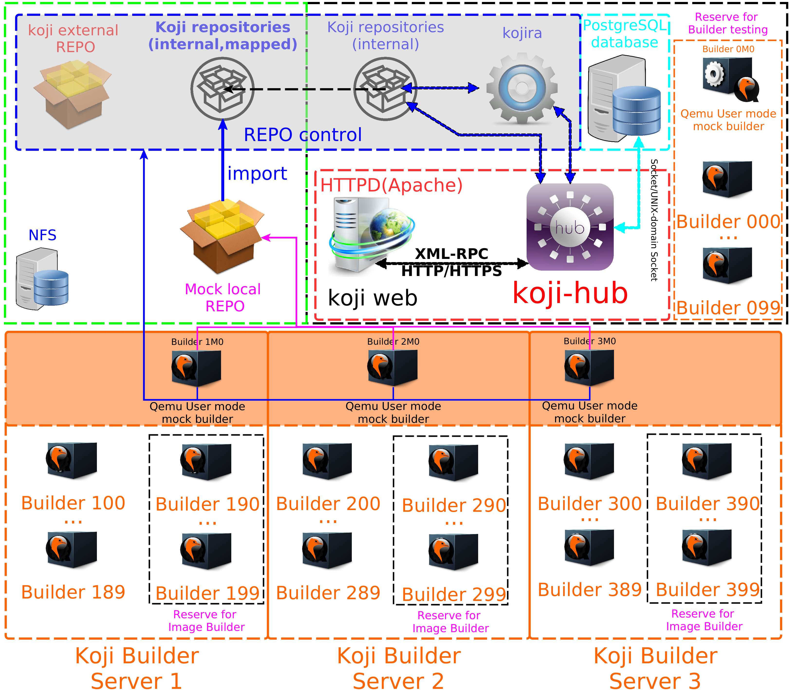
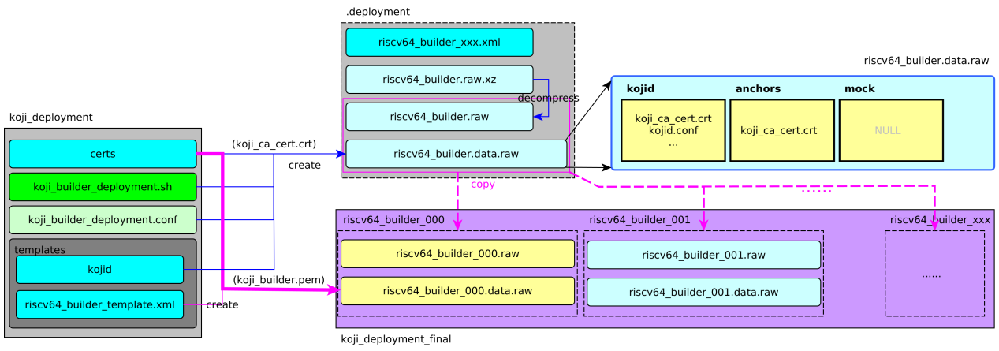

<div align='center' ><font size='20'>RISC-V builder部署</font></div>

  

# 0. 依赖条件：koji-hub系统

请参阅独立的文档《Koji部署指南-Kojihub部署》

此文档重点介绍在已经正常运行的koji系统中增加RISC-V builder。

但是对于一些文件的命名需要遵循一套规则，才能保证自动部署脚本和证书脚本可以配套使用。以下是一些暂行规则《__TekkamanV1.0》__：

- 连接符为’_’，避免‘-’被作为计算符号处理。

## a. Builder 编号规则：

- **编号[num]为三位十进制数：**
  
  - 第一位表示服务器编号\<S>，
    
    - koji builder server 1中的qemu builder 编号为1xx
    - koji-hub server的编号为0，故其中的qemu builder 编号为0xx。其中的builder一般用于测试和构建Image(in “appliance” channel)。
  
  - 后两位表示qemu builder编号\<NN>
    
    - 00～89：qemu builder in **default channels**
    
    - __90～99：__ qemu builder in some other channels, like “appliance”
  
  - mock builder 的编号为\<S>M\<N>__，M代表Mock__

## b. 证书中CN（Common Name）命名规则

**[type]\_[arch]\_[num].[subdomain].[domain]**

type: buildvm, buildhw, buildmk

arch: riscv64, ......

num: 001, ......

例如：OpenKoji：[https://openkoji.iscas.ac.cn](https://openkoji.iscas.ac.cn/)

buildvm_riscv64_001.openkoji.iscas.ac.cn

## c. Builder 命名规则：

**这个名称会在添加builder到kojihub的时候用到，必须与证书CN保持一致。**

[type]\_[arch]_[num].[subdomain].[domain]

- Koji builder命名范例: buildvm_riscv64_000.openkoji.iscas.ac.cn
- Mock builder命名范例: buildmk_riscv64_0M0.tekkamanv.com

## d. Builder 证书文件名规则：

为更好地在自动部署时识别证书文件，脚本生成的证书文件名统一为：

- __客户端证书：__[type]\_[arch]_[num].[subdomain].[domain].pem
  - 即 __<证书CN>.pem__
- __CA证书：__[servername]\_ca_cert.crt，默认为：koji\_ca_cert.crt

为了统一Image的配置文件，builder中统一路径保持默认配置为：

- **客户端证书：**/etc/kojid/client.crt
- **CA证书：**/etc/kojid/serverca.crt

## e. Builder Image命名规则：

只有buildvm才使用Image文件，且都部署在[subdomain].[domain]，故这些部分可以省略：

系统Image：[arch]_[num].raw

数据Image：[arch]_[num].data.raw

# 1. koji-hub端配置

## a. 在系统中添加builder

首先我们要将builder添加到系统中。

**请确保这步在第一次使能 kojid 守护进程之前完成，否则为了使系统正常工作，您不得不使用“--force”参数来修正**（或者手动删除数据库中 sessions 和 users 表中的记录--待确认）。

```shell
koji add-host <common name> <arch>
#Usage: koji add-host [options] <hostname> <arch> [<arch> ...]
#(Specify the --help global option for a list of other help options)
#Options:
#  -h, --help            show this help message and exit
#  --krb-principal=KRB_PRINCIPAL
#                        set a non-default kerberos principal for the host
#  --force               if existing used is a regular user, convert it to a
#                        host
```

- 第一个参数是builder的主机名（证书中的common name）
- 第二个参数用来指定builder支持的系统架构类型。

## b. 让builder接受特定任务类型

频道（channel）是用来控制哪台builder可以执行哪种类型任务的一种方法。默认情况下，builder被加入到 default 频道中。至少还需要将部分builder添加到 createrepo 频道（例如，koji server本身安装kojid专门作为仓库操作builder），这样就有builder来执行 kojira 提交的 repo creation 任务了。

```shell
#Usage: koji add-host-to-channel [options] <hostname> <channel>
#(Specify the --help global option for a list of other help options)
#Options:
#  -h, --help  show this help message and exit
#  --new       Create channel if needed
#  --force     force added, if possible
```

例如

- 创建/更新仓库
  
  ```shell
  koji add-host-to-channel <common name> createrepo
  ```

- 生成镜像
  
  ```shell
  koji add-host-to-channel <common name> appliance     
  ```

## c. 修改负载能力

添加到数据库 host 表中的builder的默认负载能力是 2。这意味着如果一台builder的平均负载超过了 2，builder上的 kojid 守护进程将不再接收新的任务。这和配置文件中的最大任务数是两个不同的控制量。kojid 在接收一个任务之前需要先检查系统负载和待执行的任务数量， 确保平均负载没有超过builder的平均负载能力，并且kojid已经接收等待执行的任务数量小于最大任务数。然而，在四核甚至更多核 CPU 广泛使用的今天，将平均负载设定为 2 不能充分发挥硬件的性能。

**修改方法如下：**

- 命令行工具：
  
  ```shell
  koji edit-host --capacity=4  localhost_x86_64
  #koji edit-host <hostname> [<hostname> ...] [options]
  #  --arches=ARCH1,ARCH2, ...,
  #  --capacity=CAPACITY  Capacity of this host
  #  --description=DESC   Description of this host
  #  --comment=COMMENT    A brief comment about this host
  ```

- 手动修改数据库:
  
  ```shell
  sudo su koji
  [koji@Samantha ~]$ psql koji
  psql (13.4)
  Type "help" for help.
  
  koji=> select (host_id, capacity) from host_config;
    row  
  -------
   (1,2)
  (1 row)
  
  koji=> update host_config set capacity = 4 where host_id = 1;
  UPDATE 1
  koji=> 
  ```

# 2.签发builder证书

签发证书的脚本范例：

**cert-issue.sh：**

```shell
#!/bin/bash
WORK_DIR=/etc/pki/koji

EXPIRE_DAYS=3650
PASSPHRASE_FILE=pw.txt
SSL_CONF_TEMPLATE=openssl.conf
# if you change your certificate authority name to something else you will
# need to change the caname value to reflect the change.
caname=koji
CA_CERT_PRI_KEY=${WORK_DIR}/private/${caname}_ca_cert.key
CA_CERT_CRT=${WORK_DIR}/${caname}_ca_cert.crt

# __HOST_NAME is equal to parameter one or the first argument when you actually
# run the script
ORG_UNIT=Koji
SERVER_NAME=koji.tekkamanv.com
__ORG_UNIT=${ORG_UNIT}
__EMAIL_ADDR=${1}@${SERVER_NAME}
__HOST_NAME=${1}
__PRI_KEY=${WORK_DIR}/private/${__HOST_NAME}.key
__CSR_FILE=${WORK_DIR}/certs/${__HOST_NAME}.csr
__CRT_FILE=${WORK_DIR}/certs/${__HOST_NAME}.crt
__PEM_FILE=${WORK_DIR}/${__HOST_NAME}.pem

__COMMON_NAME=${1}
SSL_CONF_SUBJ_COM='/C=CN/ST=Guangdong/L=Shenzhen/O=TekkamanV'
__SSL_CONF_SUBJ="${SSL_CONF_SUBJ_COM}/OU=${__ORG_UNIT}/CN=${__COMMON_NAME}/emailAddress=${__EMAIL_ADDR}"


sudo openssl genrsa \
    -out ${__PRI_KEY} 2048 \
&& \
sudo openssl req -new -nodes -passin file:${PASSPHRASE_FILE} \
    -config ${SSL_CONF_TEMPLATE} \
    -subj ${__SSL_CONF_SUBJ} \
    -key ${__PRI_KEY} \
    -out ${__CSR_FILE} \
&& \
sudo openssl ca -batch -passin file:${PASSPHRASE_FILE} \
    -config ${SSL_CONF_TEMPLATE} \
    -out ${__CRT_FILE} \
    -infiles ${__CSR_FILE} \
&& \
sudo cat ${__CRT_FILE} ${__PRI_KEY}  | sudo tee ${__PEM_FILE} > /dev/null
```

- 签发一个builder证书的过程：
  
  ```shell
  sudo ./cert-issue.sh <common name>
  ```

# 3. 部署kojid [以localhost 部署仓库维护builder为例]

Kojid 是运行于每台Builder上的编译守护进程，主要负责查询从kojihub发来的构建任务请求，并根据实际情况进行处理。Koji除了编译RPM软件包还支持其他任务类型。如制作 livecd 镜像文件或者原始磁盘镜像文件等任务，也可由 kojid 进行处理。kojid 利用 mock 创建原始的编译环境，并且为每一次编译任务单独创建一个编译环境， 确保编译过程不会受到其他编译过程的干扰。kojid 是用 Python 实现的，并通过 XML-RPC 与 koji-hub 进行通信。

## a. 安装

```shell
sudo yum install koji-builder
```

## b. 配置

- **/etc/kojid/kojid.conf - Kojid 守护进程配置文件**

- **服务配置文件：**
  
  - __/usr/lib/systemd/system/kojid.service__
  
  - ~~/etc/sysconfig/kojid [systemV 配置文件，已经被删除]~~
    
    ```shellsession
    commit 542909e396dd38aa6ed71303fad2c40c654f4a63
    Author: Kevin Fenzi <kevin@scrye.com>
    Date:   Sun Aug 2 12:19:41 2020 -0700
    
        Update to 1.22.0.
        Remove python2 suppport, move to python3 on everything except epel6/7
    ```

- /etc/kojid/kojid.conf中的关键配置
  
  - server：koji hub的xmlrpc接口 URL
  
  - topurl：koji hub的文件访问接口 URL
    
    ```shell
    ; The URL for the xmlrpc server
    server=http://koji.tekkamanv.com/kojihub
    ; The URL for the file access
    topurl=http://koji.tekkamanv.com/kojifiles
    ```
  
  - workdir：临时存储目录
    
    注意：这个配置路径不能与 kojihub.conf 文件中的 KojiDir 配置相同(可以是 KojiDir 中的子目录，但不可和 KojiDir 相同)
    
    ```shell
    ; The directory root for temporary storage
    workdir=/tmp/koji
    ```
  
  - 认证配置 (SSL 证书)
    
    它们指向客户端证书和CA证书所存放的位置。
    
    以下是默认配置：
    
    ```shell
    ;client certificate
    ; This should reference the builder certificate we created above, for
    ; kojibuilder1.example.com
    cert = /etc/kojid/client.crt
    
    ;certificate of the CA that issued the HTTP server certificate
    serverca = /etc/kojid/serverca.crt
    ```
    
    所以也可将证书拷贝到相应的位置，保持默认配置：
    
    ```shell
    sudo cp /etc/pki/koji/<common name>.pem  /etc/kojid/client.crt
    [sudo] password for tekkamanninja: 
    sudo cp /etc/pki/koji/koji_ca_cert.crt /etc/kojid/serverca.crt
    ```
    
    注意: 如果koji builder与 部署koji hub / koji web 的服务器不是同一台，请将CA证书和客户端证书拷贝到 __builder的 /etc/kojid/ 目录中。__
  
  - 其他可能需要修改的配置项。
    
    ```shell
    smtphost=koji.tekkamanv.org
    from_addr=<common name>@koji.tekkamanv.org
    ```

# 4. 开启 Kojid

**一旦将builder添加到了koji-hub系统中，您就可以开启builder中的 kojid 守护进程。再次注意：在builder使能kojid 前，请先将builder添加到koji-hub系统中。**

```shell
sudo systemctl enable kojid --now
```

请检查日志文件 /var/log/kojid.log 确保 kojid 已经成功开启。如果日志文件没有显示任何错误信息，builder就已经配置好了，可以开始工作了。您可以在浏览器中输入系统的网址，点击 hosts 标签，这个页面会显示数据库中builder的列表以及每台builder的状态信息。

# 5. Qemu Builder部署

我们在编译服务器上使用libvirtd/virsh工具来管理镜像和模拟器：

## a) 安装软件（host）

```shell
sudo dnf install libvirt libvirt-client qemu qemu-img qemu-system-riscv
```

## b) 网络环境配置

通过libvirt部署QEMU Builder，其网络环境可能需要做一些调整：

### 1 防火墙配置

__如果QEMU Builder 同kojihub部署在同一台物理服务器上，__ 那就意味这他们之间的网络通信是通过virbr0接口的，此时就需要 __在kojihub防火墙上对这个接口的https/http端口开放__：

```shell
$ sudo firewall-cmd --list-all-zones
......
libvirt (active)
  target: ACCEPT
  icmp-block-inversion: no
  interfaces: virbr0
  sources: 
  services: dhcp dhcpv6 dns ssh tftp
  ports: 
  protocols: icmp ipv6-icmp
  forward: no
  masquerade: no
  forward-ports: 
  source-ports: 
  icmp-blocks: 
  rich rules: 
    rule priority="32767" reject
......
$ sudo firewall-cmd --add-service=https --zone=libvirt  --permanent
$ sudo firewall-cmd --add-service=http --zone=libvirt  --permanent
$ sudo systemctl restart firewalld
```

### 2 DNS配置

网络中的DNS服务器需要可以解析出kojihub的域名，否则就需要在 __QEMU Builder 所在的物理服务器的/etc/hosts文件中增加解析，libvirt会将这个信息导给QEMU，例如在kojihub上__

```shell
$ ip addr show virbr0
3: virbr0: <BROADCAST,MULTICAST,UP,LOWER_UP> mtu 1500 qdisc noqueue state UP group default qlen 1000
    link/ether 52:54:00:56:c2:c6 brd ff:ff:ff:ff:ff:ff
    inet 192.168.122.1/24 brd 192.168.122.255 scope global virbr0
       valid_lft forever preferred_lft forever
$ cat /etc/hosts
#127.0.0.1   koji.tekkamanv.com
192.168.122.1   koji.tekkamanv.com
```

**确保修改生效可能需要重启builder**

## c) 下载必要资源

```shell
https://openkoji.iscas.ac.cn/pub/dl/riscv/qemu/koji_builder/
- Fedora Koji Builder OS： fedora-riscv64-image-builder-latest.raw.zst
    - 针对Builder的修改：fedora-riscv64-image-builder-mod-v2.ks
- RISC-V OpenSBI ：fw_dynamic.bin
- U-Boot：u-boot.bin
- Builder VM template：riscv64_builder_template.xml
```

## d) 解压并拷贝到storage pool和固件目录中

关于 __storage pool和固件目录的权限设置__, 请参考《在Fedora上使用virt-manager/QEMU测试RISC-V 图形桌面系统》

```shell
STORAGE_POOL=/var/lib/libvirt/images/
FW_DIR=/var/lib/libvirt/images/
unzst fedora-riscv64-image-builder-latest.raw.zst
sudo mv fedora-riscv64-image-builder-latest.raw $STORAGE_POOL
sudo cp fw_dynamic.bin u-boot.bin $FW_DIR
```

## e) 修改定义builder的XML文件

riscv64_builder_template.xml：

```shell
BUILDER_NAME_PREFIX=qemu_riscv64_
NUM=001
OPENSBI_PATH=/var/lib/libvirt/images/fw_dynamic.bin
UBOOT_PATH=/var/lib/libvirt/images/u-boot.bin
STORAGE_POOL=/var/lib/libvirt/images/

cp riscv64_builder_template.xml  ${BUILDER_NAME_PREFIX}_${NUM}.xml
做适当修改：
sed -i \
-e "s|@@builder_name@@|${BUILDER_NAME_PREFIX}_${NUM}|g" \
-e "s|@@opensbi_bin@@|${OPENSBI_PATH}|g" \
-e "s|@@uboot_bin@@|${UBOOT_PATH}|g" \
-e "s|@@image_builder_OS@@|${STORAGE_POOL}/${BUILDER_OS_PREFIX}_${NUM}.raw|g" \
-e "s|@@image_builder_data@@|${STORAGE_POOL}/${BUILDER_DATA_PREFIX}_${NUM}.data.raw|g" \
${BUILDER_NAME_PREFIX}_${NUM}.xml
```

## f) 生成builder数据盘

在用脚本自动生成Image时，可在此时通过nbd注入必要文件，比如kojid配置文件和证书。

```shell
WORK_DIR=$(pwd)
TMP_DIR=${WORK_DIR}/.deployment
KOJI_BUILDER_DATA_MNT_DIR=${TMP_DIR}/mnt
BUILDER_NAME_PREFIX=qemu_riscv64_
NUM=001
KOJI_BUILDER_DATA_MS=${BUILDER_NAME_PREFIX}_${NUM}.data.raw 
KOJI_BUILDER_DATA_NDB_DEV=/dev/nbd8

mkdir -p $KOJI_BUILDER_DATA_MNT_DIR

#创建80G空 RAW 文件
qemu-img create -f raw ${TMP_DIR}/${KOJI_BUILDER_DATA_MS} 80G

#创建分区表
sgdisk --clear -g --new=1:4096:0 \
    --change-name=1:"kb_data" \
    --typecode=1:EBD0A0A2-B9E5-4433-87C0-68B6B72699C7 \
    ${TMP_DIR}/${KOJI_BUILDER_DATA_MS}

#格式化分区
sudo qemu-nbd -f raw  --connect ${KOJI_BUILDER_DATA_NDB_DEV} \
    ${TMP_DIR}/${KOJI_BUILDER_DATA_MS}
sudo mkfs.ext4 ${KOJI_BUILDER_DATA_NDB_DEV}p1
sudo fsck -vf ${KOJI_BUILDER_DATA_NDB_DEV}p1


#注入必要配置文件和证书#####可选步骤,可通过virsh登陆设置以下内容，详见下节#####
#挂载块设备
sudo mount -v ${KOJI_BUILDER_DATA_NDB_DEV}p1 \
    ${KOJI_BUILDER_DATA_MNT_DIR}

#注入配置文件
sudo cp -rv ${TMP_DATA_DIR}/* ${KOJI_BUILDER_DATA_MNT_DIR}
#注入证书文件
sudo cp -v ${KOJID_PEMS_DIR}/${KOJID_PEMS_PREFIX}_${1}.pem \
    ${KOJI_BUILDER_DATA_MNT_DIR}/kojid/${KOJID_PEMS_PREFIX}.pem

#修正文件属主
sudo chown -R root.root ${KOJI_BUILDER_DATA_MNT_DIR}/kojid
sudo chown -R root.root ${KOJI_BUILDER_DATA_MNT_DIR}/anchors
sudo chown root.root ${KOJI_BUILDER_DATA_MNT_DIR}/kojid/${KOJID_PEMS_PREFIX}.pem

#同步数据
sync
#卸载块设备
sudo umount ${KOJI_BUILDER_DATA_MNT_DIR}
#注入完成#####################################


sudo qemu-nbd --disconnect ${KOJI_BUILDER_DATA_NDB_DEV}
```

## g) 使能并启动libvirtd服务

```shell
sudo systemctl enable --now libvirtd
```

## h) 创建（libvirtd管理的）Qemu builder

```shell
BUILDER_NAME_PREFIX=qemu_riscv64_
NUM=001
sudo virsh define ${BUILDER_NAME_PREFIX}_${NUM}.xml
#启动Qemu
sudo virsh start ${BUILDER_NAME_PREFIX}_${NUM}
#标记为随宿主机一起自动启动
sudo virsh autostart ${BUILDER_NAME_PREFIX}_${NUM}
```

## i) 进入Qemu模拟器配置builder

### 3 连接Qemu串口终端

```shell
sudo virsh console ${BUILDER_NAME_PREFIX}_${NUM}
```

**以下操作在Qemu中：**

### 4 以root登录，默认密码为 “__riscv__”。

### 5 拷贝证书到Builder的镜像中

可以通过scp将koji hub 服务器中的证书拷贝到Builder中：

- **客户端证书：**/etc/pki/koji/.pem
  
  ---->(Qemu镜像中的)/etc/kojid/client.crt

- **CA证书：**/etc/pki/koji/koji_ca_cert.crt
  
  ---->(Qemu镜像中的)/etc/kojid/serverca.crt
  
  ---->(Qemu镜像中的)/etc/pki/ca-trust/source/anchors/serverca.crt

### 6 让builder信任koji hub的自建CA

```shell
# update-ca-trust
```

### 7 修改Qemu镜像中的kojid配置文件/etc/kojid.conf

针对QEMU需要修改的配置 __hightlight__ 如下：

```shell
[kojid]
; The number of seconds to sleep between tasks
; sleeptime=15

; The maximum number of jobs that kojid will handle at a time
maxjobs=2

; The minimum amount of free space (in MBs) required for each build root
minspace=49152

; The directory root where work data can be found from the koji hub
; topdir=/mnt/koji

; The directory root for temporary storage
; workdir=/tmp/koji

; The temporary directory in buildroot
; chroot_tmpdir = /chroot_tmpdir

; The directory root for mock
; mockdir=/var/lib/mock

; The user to run as when doing builds
; mockuser=kojibuilder

; The vendor to use in rpm headers
; vendor=Koji

; The packager to use in rpm headers
; packager=Koji

; The distribution to use in rpm headers
; distribution=Koji

; The _host string to use in mock
; mockhost=koji-linux-gnu

; Timeout for build duration (3600 sec * 24 hours * 5 day)
rpmbuild_timeout=432000

; Install timeout(seconds) for image build
; Default value is 0, which means using the number in /etc/oz/oz.cfg,
; supported since oz-0.16.0
; oz_install_timeout=7200

; The URL for the xmlrpc server
server=https://koji.tekkamanv.com/kojihub

; The URL for the file access
topurl=https://koji.tekkamanv.com/kojifiles

; use createrepo_c rather than createrepo
; use_createrepo_c=True

; A space-separated list of tuples from which kojid is allowed to checkout.
; The format of those tuples is:
;
;     host:repository[:use_common[:source_cmd]]
;
; Incorrectly-formatted tuples will be ignored.
;
; If use_common is not present, kojid will attempt to checkout a common/
; directory from the repository.  If use_common is set to no, off, false, or 0,
; it will not attempt to checkout a common/ directory.
;
; source_cmd is a shell command (args separated with commas instead of spaces)
; to run before building the srpm. It is generally used to retrieve source
; files from a remote location.  If no source_cmd is specified, "make sources"
; is run by default.
;allowed_scms=scm.example.com:/cvs/example git.example.org:/example svn.example.org:/users/*:no 
allowed_scms=gitee.com:src-oepkgs-fedora-rv/*:no:true *.fedoraproject.org:*:no:fedpkg,sources fedora.riscv.rocks:*:no:fedpkg,sources *:*:no:fedpkg,sources

; The mail host to use for sending email notifications
;smtphost=example.com
smtphost=koji.tekkamanv.com

; The From address used when sending email notifications
from_addr=TekkamanV <tekkamanv@163.com>

;configuration for Kerberos authentication

;the format of the principal used by the build hosts
;%s will be replaced by the FQDN of the host
;host_principal_format = compile/%s@EXAMPLE.COM

;location of the keytab
;keytab = /etc/kojid/kojid.keytab

;the service name of the principal being used by the hub
;krbservice = host

;configuration for SSL authentication

;client certificate
cert = /etc/kojid/client.crt

;certificate of the CA that issued the HTTP server certificate
serverca = /etc/kojid/serverca.crt

;if set to True, failing subtask will not automatically cancel other siblings
;build_arch_can_fail = False

;if set to True additional logs with timestamps will get created and uploaded
;to hub. It could be useful for debugging purposes, but creates twice as many
;log files
log_timestamps = False
;log_timestamps = True
```

### 8 启动kojid服务

**确保 /var/lib/mock的可用空间 > [minspace] (上一步在kojid.conf配置)， builder状态才会进入ready状态。**

```shell
systemctl start kojid
```

### 克隆现有虚拟机命令（参考）

```shell
sudo virt-clone --auto-clone -n <new builder name> --auto-clone -m RANDOM --original <original builer name>
```

## j) 删除已经部署的builder

### 1 删除虚拟机

```shell
sudo virsh destroy    buildvm_riscv64_xxx
sudo virsh undefine buildvm_riscv64_xxx
```

### 2 删除Image

```shell
 sudo rm /var/lib/libvirt/images/riscv64_xxx*
```

### 3 disable host in koji

```shell
koji disable-host buildvm_riscv64_xxx.openkoji.iscas.ac.cn
```

注意：koji中的host是无法删除的，只能disable。

# 6. 批量部署参考脚本：

[https://gitee.com/etux/koji_tools](https://gitee.com/etux/koji_tools)



## a) koji hub:

### 1 koji_certs-issue_openkoji.conf:

```shell
CN_NUM_START=4
CN_NUM_END=6
```

### 2 commands:

```shell
#生成CN列表，并预览
./koji_certs-issue.sh  -C ./koji_certs-issue_openkoji.conf -l
#cat ./cn_list.txt
#在koji系统中注册
./koji_certs-issue.sh  -C ./koji_certs-issue_openkoji.conf -R
./koji_certs-issue.sh  -C ./koji_certs-issue_openkoji.conf -f
./koji_certs-issue.sh  -C ./koji_certs-issue_openkoji.conf -p
```

## b) koji builder server:

### 1 配置koji_builder_deployment_openkoji.conf(可选):

此修改可以通过命令行参数改变，此修改可选。

```shell
CN_NUM_START=4
CN_NUM_END=6
```

### 2 commands:

```shell
sudo ./koji_builder_deployment.sh -C koji_builder_deployment_openkoji.conf -s 100 -e 115


sudo dnf install supervisor
sudo -e /etc/supervisord.conf 
sudo -e /etc/supervisord.d/py-fake-smtpd.ini
sudo systemctl enable supervisord.service 
sudo systemctl start supervisord.service 
sudo supervisorctl reload
sudo supervisorctl status
```
